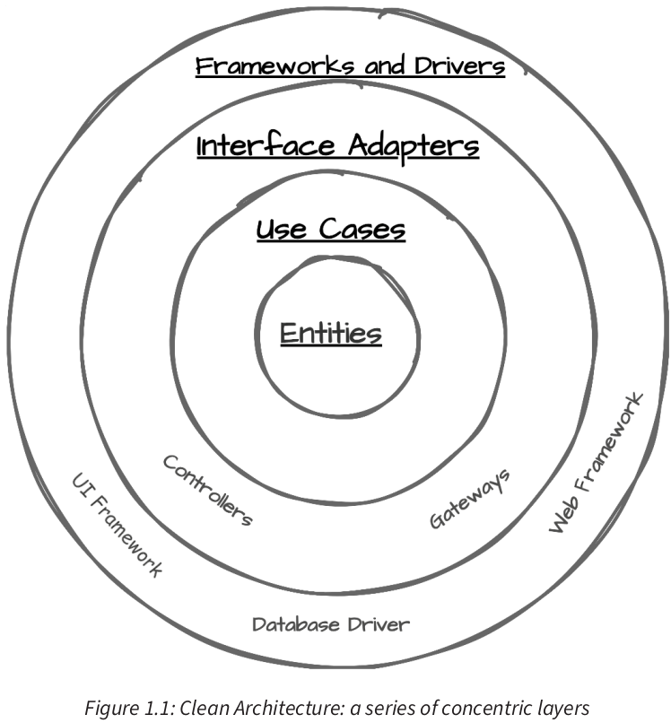
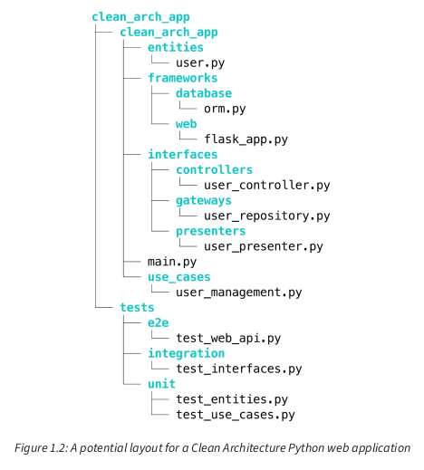

<div dir="rtl" style="text-align: right;">

### فصل 1: اصول معماری تمیز: تحول توسعه پایتون

این فصل مفاهیم اساسی معماری تمیز را معرفی می‌کند و توضیح می‌دهد که چرا این اصول برای توسعه‌دهندگان پایتون اهمیت دارند. هدف این است که یک دید کلی از اصول معماری تمیز و مزایای آن برای توسعه پایتون ارائه شود.

#### نیازمندی‌های فنی (Technical requirements)

کدهای ارائه شده در این فصل تنها برای اهداف نمایشی هستند. نمونه کدهای کامل‌تر در فصل‌های آتی ارائه می‌شوند و تمامی کدها در مخزن گیت‌هاب کتاب موجود است.

#### چرا معماری تمیز در پایتون: مزایای ایجاد تعادل بین برنامه‌ریزی و چابکی

(Why Clean Architecture in Python: the benefits of balancing planning and agility)

این بخش به بررسی چگونگی کمک معماری تمیز به ایجاد تعادل حیاتی بین برنامه‌ریزی و چابکی در توسعه پایتون می‌پردازد.

* **چالش پیچیدگی در توسعه مدرن پایتون (The complexity challenge in modern Python development)**
  با افزایش محبوبیت پایتون، مقیاس و پیچیدگی برنامه‌های ساخته شده با آن نیز افزایش یافته است. **بدون راهنمایی مناسب، کدهای پایتون می‌توانند به یک درهم‌ریختگی از سلسله‌مراتب کلاس‌های تودرتو یا به کلاس‌های عظیم و یکپارچه تبدیل شوند**.

  * **مثال PyShop**: یک سایت تجارت الکترونیک فرضی به نام PyShop می‌خواهد یک ویژگی ساده "بسته‌بندی هدیه" را اضافه کند. این ویژگی به سرعت به یک پروژه پیچیده تبدیل می‌شود که نیاز به به‌روزرسانی در ماژول پردازش سفارش، سیستم موجودی، موتور قیمت‌گذاری، رابط کاربری (UI) و سیستم تحویل دارد. این نشان می‌دهد که چگونه ماژول‌های درهم‌تنیده می‌توانند یک تغییر ساده را به یک کار بزرگ تبدیل کنند و نیاز به معماری‌ای دارند که تغییرات ایزوله‌تر و تست آسان‌تر را ممکن سازد.
* **ضرورت چابکی (The agility imperative)**
  چابکی پایدار نیازمند تصمیمات معماری است که از تکامل مداوم پشتیبانی کند. بدون معماری منسجم، افزودن سریع ویژگی‌ها می‌تواند منجر به ایجاد شبکه‌ای درهم‌تنیده از وابستگی‌ها شود.
* **برقراری تعادل: مبادله برنامه‌ریزی و چابکی (Striking a balance: the planning–agility trade-off)**
  **معماری خوب به شما کمک می‌کند تصمیمات را به تأخیر بیندازید.** این به شما انعطاف‌پذیری می‌دهد تا تصمیمات را به مراحل بعدی موکول کنید، زمانی که اطلاعات بیشتری برای انتخاب صحیح دارید. تفکر معماری در توسعه پایتون به معنای در نظر گرفتن ساختار بلندمدت پروژه از ابتدا، بدون مهندسی بیش از حد است.
* **نقش معماری در مدیریت پیچیدگی (The role of architecture in managing complexity)**
  **معماری موثر بهترین ابزار برای مدیریت پیچیدگی در سیستم‌های پایتون است.** یک معماری خوب سیستم‌های پیچیده را با ارائه یک ساختار واضح و تفکیک دغدغه‌ها (SoC) ساده می‌کند.

  * **مثال سیستم مدیریت محتوا (CMS)**: در یک CMS با معماری خوب، افزودن ویژگی تگ‌گذاری محتوا با هوش مصنوعی به عنوان یک ماژول مستقل با رابط‌های واضح انجام می‌شود و به راحتی با ماژول‌های موجود یکپارچه می‌شود. در مقابل، در یک سیستم با ساختار ضعیف، همین ویژگی نیاز به تغییرات گسترده در کل سیستم دارد که منجر به باگ‌ها و مشکلات عملکردی غیرمنتظره می‌شود. این نشان می‌دهد که چگونه معماری اولیه می‌تواند کارایی توسعه و سازگاری سیستم را بهبود بخشد.
* **آماده‌سازی برای معماری تمیز (Preparing for Clean Architecture)**
  **معماری تمیز در هسته خود، تفکیک دغدغه‌های استراتژیک (SoC) در برنامه‌های پایتون شماست.** این معماری از ساختاری حمایت می‌کند که منطق اصلی کسب‌وکار از عوامل خارجی مانند رابط‌های کاربری (UIs)، پایگاه‌های داده و یکپارچه‌سازی‌های شخص ثالث محافظت می‌شود. این تفکیک، مرزهای واضحی بین بخش‌های مختلف برنامه ایجاد می‌کند که هر کدام مسئولیت‌های خاص خود را دارند.

#### معماری تمیز چیست؟ (What is Clean Architecture?)

این بخش یک نمای کلی از معماری تمیز ارائه می‌دهد.

* **مفهوم معماری پیازی (The onion architecture concept)**
  معماری تمیز اغلب به صورت مجموعه‌ای از دایره‌های متحدالمرکز، مانند یک پیاز، تصور می‌شود. **قانون وابستگی (Dependency Rule)** که یکی از مهم‌ترین جنبه‌های معماری تمیز است، تضمین می‌کند که وابستگی‌ها فقط به سمت داخل این مرزها جریان یابند. لایه‌های هسته شامل منطق کسب‌وکار (اشخاص/موجودیت‌ها یا Entities) هستند، در حالی که لایه‌های بیرونی شامل جزئیات رابط و پیاده‌سازی هستند.

  * **شکل 1.1: معماری تمیز: مجموعه‌ای از لایه‌های متحدالمرکز (Figure 1.1: Clean Architecture: a series of concentric layers)**

    

    این شکل جداسازی منطق اصلی کسب‌وکار را به سمت رابط‌های خارجی نشان می‌دهد:

    * **موجودیت‌ها (Entities)**: در مرکز قرار دارند و قوانین کسب‌وکار در سطح سازمانی را کپسوله می‌کنند. این‌ها اشیاء اصلی کسب‌وکار هستند که حتی بدون نرم‌افزار نیز وجود خواهند داشت. مثال‌ها: مشتری (Customer)، محصول (Product)، سفارش (Order) در سیستم تجارت الکترونیک؛ یا کاربر (User)، وظیفه (Task)، پروژه (Project) در برنامه مدیریت وظایف. این موجودیت‌ها شامل اساسی‌ترین و جهانی‌ترین قوانین در مورد نحوه رفتار و تعامل این اشیاء هستند.
    * **Use Caseها (Use Cases)**: لایه بعدی شامل Use Caseها است که جریان داده را به و از موجودیت‌ها هماهنگ می‌کند. یک Use Case نمایانگر یک روش خاص استفاده از سیستم است. مثال‌ها: ایجاد وظیفه جدید (Create New Task)، تکمیل وظیفه (Complete Task) یا اختصاص وظیفه (Assign Task) در برنامه مدیریت وظایف. Use Caseها شامل قوانین کسب‌وکار خاص برنامه هستند و نحوه و زمان استفاده از موجودیت‌ها را برای دستیابی به اهداف برنامه کنترل می‌کنند.
    * **آداپتورهای رابط (Interface Adapters)**: لایه بعدی، آداپتورهای رابط هستند که داده‌ها را بین Use Caseها و عوامل خارجی تبدیل می‌کنند. این لایه به عنوان مجموعه‌ای از مترجمان بین لایه‌های داخلی (موجودیت‌ها و Use Caseها) و لایه بیرونی عمل می‌کند. این شامل کنترل‌کننده‌ها (Controllers) که درخواست‌های HTTP را مدیریت می‌کنند، ارائه‌دهندگان (Presenters) که داده‌ها را برای نمایش فرمت می‌کنند و گیت‌وی‌ها (Gateways) که داده‌ها را برای پایداری تبدیل می‌کنند، می‌شود.
    * **لایه‌های چارچوب‌ها و درایورها (Frameworks and Drivers)**: بیرونی‌ترین لایه، شامل پیاده‌سازی‌های خارجی مانند پایگاه‌های داده (به عنوان مثال، SQLite یا PostgreSQL)، چارچوب‌های وب (به عنوان مثال، Flask یا FastAPI)، رابط‌های کاربری (به عنوان مثال، CLI یا UI وب)، چارچوب‌های UI (به عنوان مثال، PyQt) و ابزارهای سیستم برای وظایفی مانند ثبت رویداد (logging) یا مدیریت پیکربندی است. این لایه ناپایدارترین است، زیرا در آن با دنیای بیرون تعامل داریم و فناوری‌ها به احتمال زیاد با گذشت زمان تغییر می‌کنند.
* **قانون وابستگی (The Dependency Rule)**: **وابستگی‌های کد منبع فقط باید به سمت داخل، به سمت سیاست‌های سطح بالاتر، اشاره کنند.** دایره‌های داخلی نباید چیزی در مورد دایره‌های بیرونی بدانند، در حالی که دایره‌های بیرونی باید به دایره‌های داخلی وابسته بوده و با آن‌ها سازگار شوند. این امر تضمین می‌کند که تغییرات در عناصر خارجی (مانند پایگاه‌های داده، UI یا چارچوب‌ها) بر منطق اصلی کسب‌وکار تأثیر نمی‌گذارد.

  * **مثال ساده پایتون (Simple Python example)**: در یک سیستم مدیریت کتابخانه، کلاس `Book` (هسته) چیزی در مورد `BookInventory` یا `BookInterface` (لایه بیرونی) نمی‌داند. `BookInventory` ممکن است از `Book` استفاده کند اما در مورد رابط کاربری چیزی نمی‌داند. این جداسازی تضمین می‌کند که منطق اصلی تحت تأثیر دغدغه‌های خارجی قرار نمی‌گیرد.

</div>

```python
# Example 1: Simple conceptual example demonstrating dependency rule
# (No actual code in source, this is inferred from description)
# Book is the core (inner circle)
class Book:
    def __init__(self, title: str, author: str):
        self.title = title
        self.author = author

# BookInventory is the next layer (middle circle)
class BookInventory:
    def __init__(self):
        self.books = []

    def add_book(self, book: Book):
        self.books.append(book)

    def get_book_count(self):
        return len(self.books)

# BookInterface is the outer layer (outer circle)
class BookInterface:
    def __init__(self, inventory: BookInventory):
        self.inventory = inventory

    def display_book_count(self):
        print(f"Total books in inventory: {self.inventory.get_book_count()}")

# In this structure:
# Book knows nothing about BookInventory or BookInterface.
# BookInventory uses Book but knows nothing about BookInterface.
# BookInterface uses BookInventory.
```

<div dir="rtl" style="text-align: right;">

این ساختار به ما اجازه می‌دهد که لایه‌های بیرونی را بدون تأثیر بر لایه‌های داخلی تغییر دهیم یا حتی جایگزین کنیم.

* **مزایای معماری تمیز (Benefits of Clean Architecture)**

  * **محافظت و ایزوله‌سازی منطق اصلی کسب‌وکار (Protecting and isolating core business logic)**: ارزش واقعی برنامه شما در منطق دامنه (domain logic) شما نهفته است. معماری تمیز ساختاری را فراهم می‌کند که این اجزای حیاتی را از ناپایداری فناوری‌های خارجی محافظت می‌کند. این رویکرد **هزینه و ریسک تغییرات را به مرور زمان کاهش می‌دهد**.
  * **افزایش قابلیت تست‌پذیری (Enhanced testability)**: استقلال منطق اصلی کسب‌وکار از جزئیات خارجی، نوشتن تست‌های واحد جامع را بسیار آسان‌تر می‌کند. می‌توانید قوانین کسب‌وکار را به صورت ایزوله تست کنید، بدون نیاز به راه‌اندازی پایگاه داده یا وب سرور.
  * **انعطاف‌پذیری در انتخاب فناوری (Flexibility in technology choices)**: هسته برنامه به چارچوب‌ها یا ابزارهای خارجی وابسته نیست، به شما آزادی می‌دهد تا این عناصر را در صورت نیاز تعویض کنید.
  * **چابکی بلندمدت در توسعه (Long-term agility in development)**: این معماری به "معماری فریادزننده" (Screaming Architecture) معروف است. یعنی وقتی به ساختار سیستم نگاه می‌کنید، باید هدف و Use Caseهای آن را "فریاد بزند"، نه چارچوب‌ها یا ابزارهای مورد استفاده را. این ساختار واضح و هدف‌گرا به اعضای جدید تیم امکان می‌دهد به سرعت هدف سیستم را درک کرده و مشارکت کنند.
* **معماری تمیز در بستر (Clean Architecture in context)**

  * **تکامل از معماری لایه‌ای سنتی (Evolution from traditional layered architecture)**: معماری تمیز بر پایه مفهوم لایه‌ها بنا شده است، اما تأکید بیشتری بر [SoC](#soc) و اجرای دقیق‌تر قانون وابستگی دارد.
  * **تکمیل‌کننده با شیوه‌های توسعه مدرن (Complements modern development practices)**: به خوبی با متدولوژی‌های Agile (مانند تحویل مداوم یا Continuous Delivery) و DevOps (مانند یکپارچه‌سازی و استقرار مداوم یا CI/CD) همسو است.

#### معماری تمیز و پایتون: یک تناسب طبیعی (Clean Architecture and Python: a natural fit)

این بخش نشان می‌دهد که چگونه معماری تمیز و پایتون تناسب طبیعی با یکدیگر دارند. فلسفه پایتون، که در "ذن پایتون" (The Zen of Python) تجسم یافته است، به طرز قابل توجهی با اصول معماری تمیز همسو است.

* **پیاده‌سازی معماری تمیز در پایتون (Implementing Clean Architecture in Python)**
  ماهیت دینامیک پایتون، همراه با پشتیبانی قوی آن از پارادایم‌های برنامه‌نویسی شی‌ءگرا (OOP) و برنامه‌نویسی تابعی، به توسعه‌دهندگان امکان می‌دهد تا مفاهیم معماری تمیز را با کد [بویلرپلیتکمتر](#boilerplate) و وضوح بیشتر نسبت به بسیاری از زبان‌های دیگر پیاده‌سازی کنند. یک اصل کلیدی معماری تمیز، اتکا به انتزاعات (abstractions) به جای پیاده‌سازی‌های ملموس (concrete implementations) است.

---

* **مثال کلاس‌های پایه انتزاعی (ABCs)**:

</div>

```python
from abc import ABC, abstractmethod

class Notifier(ABC):
    """Abstract Base Class for notification services."""
    @abstractmethod
    def send_notification(self, message: str) -> None:
        """Sends a notification message."""
        pass

class EmailNotifier(Notifier):
    """Concrete implementation for sending email notifications."""
    def send_notification(self, message: str) -> None:
        print(f"Sending email: {message}")

class SMSNotifier(Notifier):
    """Concrete implementation for sending SMS notifications."""
    def send_notification(self, message: str) -> None:
        print(f"Sending SMS: {message}")

class NotificationService:
    """Coordinates notification sending using a Notifier."""
    def __init__(self, notifier: Notifier):
        self.notifier = notifier

    def notify(self, message: str) -> None:
        self.notifier.send_notification(message)

# Usage
email_notifier = EmailNotifier()
email_service = NotificationService(email_notifier)
email_service.notify("Hello via email") # Output: Sending email: Hello via email

sms_notifier = SMSNotifier()
sms_service = NotificationService(sms_notifier)
sms_service.notify("Hello via SMS") # Output: Sending SMS: Hello via SMS
```

</div>
<div dir="rtl" style="text-align: right;">


###### توضیح مثال :

* **[ABC](#abc)**: کلاس `Notifier` یک کلاس پایه انتزاعی است که رابطی را تعریف می‌کند که همه کلاس‌های Notifier باید از آن پیروی کنند. این نمایانگر یک حلقه داخلی در ساختار معماری تمیز ماست.
* **متد انتزاعی**: متد `send_notification` در `Notifier` با `abstractmethod@` علامت‌گذاری شده و پیاده‌سازی در زیرکلاس‌ها را اجباری می‌کند.
* **پیاده‌سازی‌های ملموس**: `EmailNotifier` و `SMSNotifier` کلاس‌های ملموس در حلقه بیرونی هستند. آن‌ها از `Notifier` ارث‌بری کرده و پیاده‌سازی‌های خاصی را ارائه می‌دهند.
* **معکوس کردن وابستگی (Dependency Inversion)**: کلاس `NotificationService` به کلاس انتزاعی `Notifier` وابسته است، نه به پیاده‌سازی‌های ملموس. این امر به قانون وابستگی پایبند است، زیرا کلاس انتزاعی `Notifier` (حلقه داخلی) به Notifierهای ملموس (حلقه بیرونی) وابسته نیست. این ساختار اصول معماری تمیز را شامل می‌شود: قانون وابستگی را رعایت می‌کند، امکان توسعه آسان را فراهم می‌کند و انعطاف‌پذیری و قابلیت نگهداری را ترویج می‌دهد.
* **Duck Typing و Protocol**: پایتون امکان پیاده‌سازی اصول معماری تمیز را بدون استفاده از سلسله‌مراتب کلاس، بلکه با اتکا به Duck Typing، فراهم می‌کند. **[Duck Typing](#-duck-typing-در-پایتون-چیست)** مفهومی برنامه‌نویسی است که در آن مناسب بودن یک شیء با وجود متدها یا ویژگی‌های خاص تعیین می‌شود، نه با نوع صریح آن.
* **مثال با Protocol (پایتون 3.8+):**

</div>

```python
from typing import Protocol

class Notifier(Protocol):
    """Protocol for notification services, using structural subtyping."""
    def send_notification(self, message: str) -> None:
        """Sends a notification message."""
        ...

class EmailNotifier: # Note: no explicit inheritance
    """Concrete implementation for sending email notifications (conforms implicitly)."""
    def send_notification(self, message: str) -> None:
        print(f"Sending email: {message}")

class SMSNotifier: # Note: no explicit inheritance
    """Concrete implementation for sending SMS notifications (conforms implicitly)."""
    def send_notification(self, message: str) -> None:
        print(f"Sending SMS: {message}")

class NotificationService:
    # Still able to use type hinting
    """Coordinates notification sending using a Notifier protocol."""
    def __init__(self, notifier: Notifier):
        self.notifier = notifier

    def notify(self, message: str) -> None:
        self.notifier.send_notification(message)

# Usage
sms_notifier = SMSNotifier()
sms_service = NotificationService(sms_notifier)
sms_service.notify("Hello via SMS") # Output: Sending SMS: Hello via SMS
```

<div dir="rtl" style="text-align: right;">

**توضیح مثال Protocol**:

* **Protocol در مقابل ABC**: کلاس `Notifier` اکنون یک کلاس `Protocol` است، که یک رابط زیرگروه‌بندی ساختاری را تعریف می‌کند، نه اینکه نیازمند ارث‌بری صریح باشد.
* **انطباق ضمنی**: کلاس‌های `EmailNotifier` و `SMSNotifier` به طور صریح از کلاس `Notifier` ارث‌بری نمی‌کنند، اما با پیاده‌سازی متد `send_notification` با رابط آن مطابقت دارند.
* **Duck Typing با Type Hinting**: این رویکرد انعطاف‌پذیری Duck Typing پایتون را با مزایای بررسی نوع استاتیک ترکیب می‌کند.
* **پیاده‌سازی‌های ملموس**: کلاس `NotificationService` همچنان به پروتکل انتزاعی `Notifier` وابسته است، نه به پیاده‌سازی‌های ملموس، که به اصول معماری تمیز پایبند است.

**استفاده از Type Hinting شدیداً توصیه می‌شود**، چه از طریق ABCs و چه پروتکل‌ها، زیرا خوانایی کد را بهبود می‌بخشد، پشتیبانی IDE را افزایش می‌دهد و تشخیص خطا را زودتر ممکن می‌سازد.

* **مثال عملی: نگاهی اجمالی به معماری تمیز در یک پروژه پایتون (Practical example: a glimpse of Clean Architecture in a Python project)**

  
  ساختار فایل یک پروژه پایتون با معماری تمیز، اصول مورد بحث را شامل می‌شود:

  * **شکل 1.2: یک طرح بالقوه برای یک برنامه وب پایتون با معماری تمیز (Figure 1.2: A potential layout for a Clean Architecture Python web application)**
    این شکل ساختار دایرکتوری‌های یک پروژه را نشان می‌دهد:

**توضیح ساختار**:

1. **تفکیک دغدغه‌ها (SoC)**: هر دایرکتوری نمایانگر یک لایه مجزا از برنامه است که با دایره‌های متحدالمرکز در شکل 1.1 همسو است.
2. **قانون وابستگی (Dependency Rule)**: این ساختار قانون وابستگی را اعمال می‌کند. لایه‌های داخلی (مانند `entities` و `use_cases`) هیچ وابستگی به لایه‌های بیرونی ندارند.
3. **لایه Entities**: دایرکتوری `entities` شامل اشیاء اصلی کسب‌وکار است (مانند `user.py`).
4. **لایه Use Cases**: دایرکتوری `use_cases` قوانین کسب‌وکار خاص برنامه را در خود جای می‌دهد. این لایه به Entities وابسته است اما از لایه‌های بیرونی مستقل است.
5. **لایه Interface Adapters**: دایرکتوری `interfaces` شامل کنترل‌کننده‌ها (controllers)، ارائه‌دهندگان (presenters) و گیت‌وی‌ها (gateways) است. این‌ها داده‌ها را بین Use Caseها و عوامل خارجی (مانند چارچوب‌های وب یا پایگاه‌های داده) تطبیق می‌دهند.
6. **لایه Frameworks**: بیرونی‌ترین دایرکتوری `frameworks` شامل پیاده‌سازی‌های رابط‌های خارجی است، مانند ORMهای پایگاه داده یا چارچوب‌های وب.
7. **تست مستقیم (Straightforward testing)**: ساختار دایرکتوری `tests` منعکس‌کننده ساختار برنامه است و امکان تست جامع در تمام سطوح را فراهم می‌کند. این ساختار، نقشه راهی واضح برای قرار دادن کدهای جدید فراهم می‌کند و تصمیم‌گیری‌های ثابت را حتی با رشد و تکامل پروژه تضمین می‌کند.

* ##### ملاحظات خاص پایتون و خطاهای بالقوه

  (Python-specific considerations and potential pitfalls)


  * **متعادل‌سازی کد Pythonic با اصول معماری (Balancing Pythonic code with architectural principles)**: فلسفه "batteries included" پایتون و کتابخانه استاندارد گسترده آن گاهی اوقات توسعه‌دهندگان را وسوسه می‌کند تا برای راحتی، از مرزهای معماری عبور کنند. با این حال، حفظ معماری تمیز اغلب شامل ایجاد انتزاع در اطراف حتی توابع کتابخانه استاندارد برای حفظ SoC است.
  * ##### مقیاس‌پذیری معماری تمیز در پروژه‌های پایتون

    (Scaling Clean Architecture in Python projects):


    * **پروژه‌های کوچک یا پروتوتایپ‌های سریع**: می‌توانند معماری ساده‌تری داشته باشند. **شکل 1.3: پروژه پروتوتایپ سریع پایتون (Figure 1.3: Quick prototype Python project)** نشان می‌دهد که حتی در پروژه‌های کوچک نیز می‌توان اصول معماری تمیز را با جدا نگه داشتن منطق کسب‌وکار در `models.py` از منطق نمایش در `views.py`، استفاده از تزریق وابستگی (DI) و تعریف رابط‌های واضح بین ماژول‌ها اعمال کرد.
    * **رشد پروژه**: با رشد پروژه، می‌توانید به تدریج به سمت یک ساختار معماری تمیز جامع‌تر حرکت کنید. این تکامل ممکن است شامل جداسازی منطق اصلی کسب‌وکار به ماژول‌های مستقل، معرفی رابط‌ها برای انتزاع کد خاص چارچوب، و سازماندهی تست‌ها برای همسویی با لایه‌های معماری باشد. معماری تمیز یک طیف است، نه یک انتخاب باینری.
  * ##### استفاده مناسب از طبیعت پویا پایتون

  (Leveraging Python’s dynamic nature appropriately)
  در حالی که ماهیت پویا پایتون قدرتمند است، اگر با دقت استفاده نشود، می‌تواند منجر به مشکلاتی شود. فصل 3 به این جنبه‌ها از جمله Duck Typing، استفاده از Type Hinting و ویژگی‌های جدیدتر مانند Protocol می‌پردازد.

  * **ملاحظات تست (Testing considerations)**: معماری تمیز قویاً استفاده از تست‌ها را ترویج می‌کند. تست‌ها به عنوان کلاینت‌های درجه یک کد برنامه شما عمل می‌کنند. اگر تست‌های شما نیاز به راه‌اندازی یا Mocking بیش از حد دارند، این نشان‌دهنده مشکلات بالقوه در معماری شماست. در فصل 8، این مفاهیم عمیق‌تر بررسی می‌شوند.

#### خلاصه (Summary)

این فصل معماری تمیز را در سطح بالا و ارتباط آن با توسعه پایتون معرفی کرد. اصول اصلی معماری تمیز مورد بررسی قرار گرفت: تفکیک دغدغه‌ها (SoC)، استقلال از جزئیات خارجی و قابلیت تست‌پذیری و نگهداری. ساختار کلی معماری تمیز، از موجودیت‌ها و Use Caseهای اصلی تا لایه‌های بیرونی آداپتورهای رابط، چارچوب‌ها و درایورها، مورد بحث قرار گرفت. همچنین، تناسب طبیعی بین معماری تمیز و پایتون و نحوه بهره‌برداری از ویژگی‌های پایتون برای پیاده‌سازی موثر معماری تمیز بررسی شد.

---

### ABC:

* `ABC`: پایه‌ای برای ساخت کلاس انتزاعی (قابل ارث‌بری).
* `abstractmethod`: دکوراتوری برای تعریف متدهایی که **الزامی است در کلاس‌های فرزند پیاده‌سازی شوند**.

##### کاربرد:

برای تعریف یک **الگو یا اینترفیس** که کلاس‌های فرزند **باید** از آن تبعیت کنند. از اصول OOP است (مطابق با SOLID - اصل Interface Segregation).

اگر کلاس `Dog` متد `make_sound` را پیاده‌سازی نکند، اجرای آن خطا می‌دهد.

##### کاربرد مهندسی:

* ساختارمند کردن کدها
* تعریف قرارداد بین کلاس‌ها
* جلوگیری از ایجاد نمونه از کلاس‌های ناقص
* کاملاً سازگار با معماری‌های ماژولار و اصول طراحی تمیز (Clean Architecture) است.

### Boilerplate

در معماری و برنامه‌نویسی پایتون، واژه **Boilerplate** به **کدهای تکراری، استاندارد و الزامی** اشاره دارد که برای اجرای صحیح یا ساختار پروژه باید نوشته شوند، اما **خودشان منطق خاص یا جدیدی ندارند**.

##### ✅ تعریف دقیق:

> **Boilerplate code** یعنی کدی که تقریباً در همه پروژه‌ها یا فایل‌ها باید نوشته شود تا ساختار، اجرا یا چارچوب فنی برقرار بماند، اما خود آن کد معمولاً تغییری در عملکرد خاص برنامه ایجاد نمی‌کند.

##### 🎯 کاربردها در پایتون:

| نوع Boilerplate                | مثال یا توضیح                                       |
| --------------------------------- | -------------------------------------------------------------- |
| `if __name__ == "__main__":`    | برای اجرای مستقیم فایل                      |
| تنظیمات پایه Django    | تنظیمات `settings.py`, ساختار پوشه‌ها    |
| تعریف کلاس‌های ABC   | استفاده از `ABC`, `abstractmethod`                |
| پیکربندی FastAPI/Flask    | تعریف app، مسیرها، middleware                     |
| اسکریپت‌های Airflow    | تعریف DAG, تنظیم پارامترهای پیش‌فرض |
| تست‌ها با unittest/pytest | ساختار test class, setup method                          |

##### 📌 مثال ساده:

```python
if __name__ == "__main__":
    main()
```

این یک **Boilerplate معروف** در پایتون است که باعث می‌شود فقط در صورت اجرای مستقیم فایل، تابع `main()` اجرا شود.

##### 🧩 دلیل اهمیت:

* حفظ ساختار استاندارد
* تسهیل در توسعه تیمی
* افزایش خوانایی و یکپارچگی
* پایه‌سازی برای معماری‌های تمیز (Clean Architecture) و ماژولار

##### 🔧 در معماری‌های بزرگ:

در پروژه‌هایی مثل Django، FastAPI یا Airflow، بخش‌هایی مثل `urls.py`, `views.py`, `dag_factory.py`, یا `api_router.py` همگی ممکن است شامل boilerplate باشند تا ساختار پروژه حفظ شود.

##### نتیجه‌گیری:

> **Boilerplate در پایتون یعنی کدی ضروری، ولی تکراری و بدون منطق سفارشی خاص.**
> برای شروع هر پروژه یا ماژول، این کد پایه لازم است تا چارچوب درستی فراهم شود.

---

### Duck Typing

### 🦆 Duck Typing در پایتون چیست؟

**Duck Typing** یک مفهوم در زبان‌های **دینامیک تایپ** مانند پایتون است که می‌گوید:

> "اگر چیزی مثل اردک راه می‌رود، مثل اردک صدا می‌دهد، پس احتمالاً اردک است."
> در پایتون یعنی:
> **اگر یک شی رفتار موردنظر (مثل داشتن متدی خاص) را دارد، مهم نیست چه کلاسی دارد.**

### ✅ تعریف فنی:

در Duck Typing، **نوع (type)** یک شی مهم نیست؛
مهم این است که آیا **متد یا ویژگی موردنیاز را دارد یا نه**.

### 🎯 کاربرد اصلی:

* **انعطاف بیشتر در طراحی کد**
* **استفاده از Interface بدون تعریف رسمی**
* ساده‌سازی اصول OOP مثل پلی‌مورفیسم (Polymorphism)

### 📌 مثال ساده:

```python
class Dog:
    def speak(self):
        return "Woof!"

class Cat:
    def speak(self):
        return "Meow!"

def make_sound(animal):
    print(animal.speak())

dog = Dog()
cat = Cat()

make_sound(dog)  # خروجی: Woof!
make_sound(cat)  # خروجی: Meow!
```

در اینجا `make_sound` اهمیتی نمی‌دهد که `dog` یا `cat` چه کلاسی دارند،
تنها شرطش این است که `speak()` داشته باشند.

### 🛠 سناریو واقعی:

فرض کنید یک سیستم هشدار دارید که با اشیای مختلف کار می‌کند:

```python
class SMSNotifier:
    def notify(self, msg):
        print("Sending SMS:", msg)

class EmailNotifier:
    def notify(self, msg):
        print("Sending Email:", msg)

def alert_system(notifier, msg):
    notifier.notify(msg)
```

اینجا نیازی نیست هر کلاس از یک **interface رسمی** ارث ببرد.
تا وقتی `notify()` وجود دارد، `alert_system` کار می‌کند. این یعنی Duck Typing.

### ⛔️ خطای احتمالی:

اگر شی‌ای که به `make_sound` بدهید متد `speak()` نداشته باشد، برنامه در زمان اجرا خطا می‌دهد (AttributeError).
پس باید یا:

* کنترل خطا کنید (`hasattr`)
* یا تست بنویسید
* یا تایپ‌چک را با `Protocol` در پایتون ۳.۸+ انجام دهید

### ✅ نتیجه‌گیری:

| ویژگی | توضیح                                                                      |
| ---------- | ------------------------------------------------------------------------------- |
| زبان   | مختص زبان‌های دینامیک (مثل پایتون، روبی)       |
| مزایا | کد منعطف، قابل گسترش، بدون وراثت اجباری        |
| معایب | خطا در زمان اجرا، نبود چک تایپ در زمان توسعه |
| مکمل   | `mypy`, `typing.Protocol` برای بررسی استاتیک                |

---

## SOC

**Separation of Concerns**

---

##### ✅ تعریف کوتاه:

> **SoC (تفکیک مسئولیت‌ها)** یک اصل معماری نرم‌افزار است که می‌گوید:
> هر **بخش از سیستم** فقط باید روی **یک "نگرانی" یا "مسئولیت مشخص" تمرکز کند.**

##### 📦 کاربرد:

در طراحی سیستم‌ها و کدنویسی (مخصوصاً در پروژه‌های ماژولار مثل Django، Flutter، Microservices)، SoC باعث می‌شود:

* کد قابل فهم‌تر، تست‌پذیرتر و نگه‌داشت‌پذیرتر شود.
* وابستگی بین اجزا به حداقل برسد.
* توسعه و دیباگ آسان‌تر شود.

##### 🎯 مثال ساده در پایتون:

```python
# مسئول دریافت ورودی
def get_input():
    return input("Enter your name: ")

# مسئول پردازش داده
def process_name(name):
    return name.upper()

# مسئول نمایش خروجی
def display_output(name):
    print(f"Hello, {name}!")
```

هر تابع، فقط یک کار خاص انجام می‌دهد:
ورودی، پردازش، خروجی → تفکیک کامل مسئولیت‌ها

##### 🏗 مثال واقعی در Django:

| Concern             | فایل یا ماژول مسئول |
| ------------------- | ----------------------------------- |
| URL Routing         | `urls.py`                         |
| Logic پردازش  | `views.py`                        |
| مدل داده     | `models.py`                       |
| قالب نمایش | `templates/`                      |
| فرم‌ها        | `forms.py`                        |

##### 📌 در Flutter:

| Concern        | بخش مسئول                       |
| -------------- | --------------------------------------- |
| UI             | `widgets/`                            |
| Business Logic | `providers`, `bloc`, `controller` |
| Data Layer     | `services`, `repositories`          |
| API            | `network/` یا `api_service.dart`  |

##### 🧠 نتیجه عملی:

* تفکیک View و Logic
* تفکیک Data Access از Business Logic
* تفکیک UI از Backend
* تفکیک Strategy از Orchestration در پروژه‌های Airflow و ETL

##### 🔧 ابزارهای مکمل:

* **MVC**, **MVVM**، **Clean Architecture**
* در پایتون: استفاده از `apps` جدا در Django
* در تست: تست واحد برای هر concern

##### ⛔️ ضد الگوها:

* **همه چیز در یک فایل**
* ترکیب View و Query مستقیم
* کنترلرهایی با ده‌ها وظیفه مختلف

##### جمع‌بندی:

| ویژگی                  | توضیح                                                             |
| --------------------------- | ---------------------------------------------------------------------- |
| هدف                      | کاهش پیچیدگی، افزایش ماژولار بودن         |
| مزایا                  | نگه‌داری آسان، تست‌پذیری، توسعه موازی |
| مکمل‌ها              | SOLID، Clean Architecture، Domain-Driven Design                      |
| سطح پیاده‌سازی | تابع، کلاس، ماژول، کل سیستم                     |

در پروژه‌های توی، به‌ویژه ساختارهای ماژولار `Django + Airflow` یا Flutter، رعایت SoC کاملاً ضروریه برای حفظ انسجام و توسعه‌پذیری سیستم.
