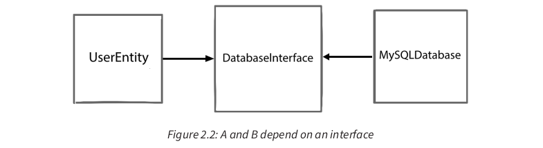
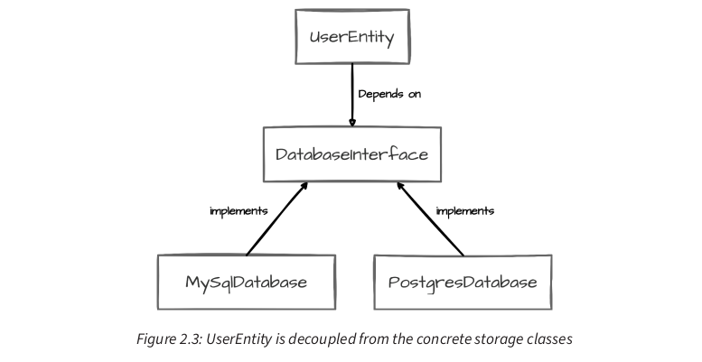

<div dir="rtl" style="text-align: right;">

## فصل 2: مبانی SOLID: ساخت برنامه‌های پایتون مقاوم

در فصل پیشین، مفاهیم اساسی معماری پاک را بررسی کردیم، که رویکردی قدرتمند برای ساخت برنامه‌های پایتون قابل نگهداری، انعطاف‌پذیر و مقیاس‌پذیر است. این فصل بر مجموعه‌ای از اصول (SOLID) که پایه و اساس معماری پاک را شکل می‌دهند، عمیق‌تر می‌شود. اصول SOLID در برنامه‌نویسی شی‌گرا و طراحی، به توسعه‌دهندگان کمک می‌کنند تا ساختارهای نرم‌افزاری قابل فهم‌تر، انعطاف‌پذیرتر و قابل نگهداری‌تری ایجاد کنند.

<br/>

### الزامات فنی

مثال‌های کد ارائه شده در این فصل و در سراسر کتاب با پایتون 3.13 تست شده‌اند. برای اختصار، مثال‌های کد در فصل ممکن است به صورت جزئی پیاده‌سازی شده باشند. نسخه‌های کامل همه مثال‌ها در مخزن گیت‌هاب کتاب موجود است.

<br/>

### طراحی کد متمرکز و قابل نگهداری: قدرت مسئولیت واحد

در سلسله مراتب طراحی نرم‌افزار، معماری سطح بالا در بالاترین رده قرار دارد و پس از آن کامپوننت‌ها، ماژول‌ها، کلاس‌ها و در نهایت توابع قرار می‌گیرند. اصول SOLID عمدتاً در سطح ماژول عمل می‌کنند و دستورالعمل‌هایی برای ایجاد کدهای با ساختار مناسب و قابل نگهداری ارائه می‌دهند. با به کارگیری اصول SOLID، می‌توانیم کامپوننت‌های با **اتصال سست (loosely coupled)** و **انسجام بالا (highly cohesive)** ایجاد کنیم که تست، تغییر و توسعه آن‌ها آسان‌تر است. این ویژگی‌ها از **ویژگی‌های اساسی معماری پاک** هستند.

#### درک مسئولیت واحد

**اصل مسئولیت واحد (Single Responsibility Principle - SRP)** بیان می‌کند که **هر ماژول نرم‌افزاری باید فقط یک دلیل برای تغییر داشته باشد**.

در ابتدا، مفهوم مسئولیت واحد ممکن است ساده به نظر برسد. با این حال، در عمل، تعریف و پیاده‌سازی آن می‌تواند چالش‌برانگیز باشد.

**مثال: کلاس `User` (ضد الگو)**
در ابتدا، کلاس `User` زیر ممکن است منطقی به نظر برسد، اما از مفهوم موجودیت در معماری پاک فاصله می‌گیرد.

</div>


```python
class User:
    def __init__(self, user_id: str, username: str, email: str):
        self.user_id = user_id
        self.username = username
        self.email = email
        self.posts = []

    def create_post(self, content: str) -> dict:
        post = {
            "id": len(self.posts) + 1,
            "content": content,
            "likes": 0
        }
        self.posts.append(post)
        return post

    def get_timeline(self) -> list:
        # Fetch and return the user's timeline
        # This might involve complex logic to fetch and
        # sort posts from followed users
        pass

    def update_profile(self, new_username: str = None,
                       new_email: str = None):
        if new_username:
            self.username = new_username
        if new_email:
            self.email = new_email
```
<div dir="rtl" style="text-align: right;">

این کلاس مسئولیت‌های متعددی مانند مدیریت اطلاعات کاربر، ایجاد پست و به‌روزرسانی پروفایل را بر عهده دارد، که هر کدام دلایل متفاوتی برای تغییر دارند.

**نکات برای شناسایی و جداسازی مسئولیت‌ها**
*   به گروه‌هایی از متدها نگاه کنید که روی زیرمجموعه‌های مختلفی از داده‌های کلاس عمل می‌کنند.
*   در نظر بگیرید که کدام جنبه‌ها تحت تأثیر انواع مختلفی از تغییرات یا الزامات قرار می‌گیرند.
*   از قانون "دلیل تغییر" استفاده کنید: اگر می‌توانید بیش از یک دلیل برای تغییر کلاس بیابید، جداسازی آن را در نظر بگیرید.

**مثال: کلاس `User` بازسازی شده (پایبند به SRP)**
نسخه بازسازی شده نه تنها به SRP پایبند است، بلکه با مفهوم موجودیت‌ها در معماری پاک نیز همسو است.

</div>


```python
class User:
    def __init__(self, user_id: str, username: str, email: str):
        self.user_id = user_id
        self.username = username
        self.email = email

class PostManager:
    def create_post(self, user: User, content: str):
        post = {
            "id": self.generate_post_id(),
            "user_id": user.user_id,
            "content": content,
            "likes": 0
        }
        # Logic to save the post
        return post

    def generate_post_id(self):
        # Logic to generate a unique post ID
        pass

class TimelineService:
    def get_timeline(self, user: User) -> list:
        # Fetch and return the user's timeline
        # This might involve complex logic to fetch and
        # sort posts from followed users
        pass

class ProfileManager:
    def update_profile(self, user: User, new_username: str = None,
                       new_email: str = None):
        if new_username:
            user.username = new_username
        if new_email:
            user.email = new_email
        # Additional logic for profile updates,
        # like triggering email verification
```
<div dir="rtl" style="text-align: right;">

در این بازسازی:
*   `User` به هسته خود بازگشته و تنها مسئول مدیریت داده‌های اصلی کاربر است.
*   `PostManager` مسئولیت متمرکز ایجاد و مدیریت پست‌ها را بر عهده می‌گیرد.
*   `TimelineService` منطق تولید تایم‌لاین را به طور مستقل مدیریت می‌کند.
*   `ProfileManager` به‌روزرسانی‌های پروفایل را مدیریت می‌کند.

**کاربردها و مزایا:** این بازسازی قابلیت نگهداری و تست‌پذیری را بهبود می‌بخشد و انعطاف‌پذیری بیشتر و وابستگی کمتری ایجاد می‌کند، که با اصول معماری پاک همسو است.

#### SRP و تست‌پذیری

کلاس‌هایی با مسئولیت واحد معمولاً آسان‌تر تست می‌شوند، زیرا وابستگی‌ها و موارد خاص کمتری دارند.

**مثال: تست `PostManager`**

</div>


```python
import unittest
from post_manager import PostManager
from user import User

class TestPostManager(unittest.TestCase):
    def test_create_post(self):
        user = User("123", "testuser", "test@example.com")
        post_manager = PostManager()
        post = post_manager.create_post(user, "Hello, world!")
        self.assertEqual(post["user_id"], "123")
        self.assertEqual(post["content"], "Hello, world!")
        self.assertEqual(post["likes"], 0)
        self.assertIn("id", post)
```
<div dir="rtl" style="text-align: right;">

این تست سادگی تست واحد را که SRP به ارمغان می‌آورد، نشان می‌دهد. `PostManager` به راحتی و بدون نیاز به تنظیمات پیچیده یا mock، به تنهایی تست می‌شود.

#### متوازن‌سازی SRP

با اینکه SRP یک اصل قدرتمند است، اما نباید آن را به افراط رساند. استفاده بیش از حد از SRP می‌تواند به تعداد زیادی کلاس و تابع کوچک منجر شود که درک و پیمایش سیستم کلی را دشوارتر می‌کند. نکته کلیدی **یافتن تعادل** است، به طوری که هر واحد کد (کلاس، تابع یا ماژول) هدف واضح و منسجمی داشته باشد، بدون اینکه آنقدر خرد شود که ساختار کلی قطعه قطعه به نظر برسد.

<br/>

### ساخت سیستم‌های قابل توسعه: پذیرش طراحی باز-بسته در پایتون

**اصل باز-بسته (Open–Closed Principle - OCP)**، که توسط Bertrand Meyer در سال 1988 معرفی شد، راهنمای ما در ایجاد سیستم‌هایی است که **برای توسعه باز هستند اما برای تغییر بسته** (open for extension but closed for modification). این بدان معناست که باید بتوانیم قابلیت‌های جدید را بدون تغییر کد موجود اضافه کنیم. OCP ابزاری قدرتمند است که در هماهنگی با SRP برای ایجاد کدهای ماژولار و انعطاف‌پذیر عمل می‌کند.

**مثال: محاسبه‌گر مساحت اولیه (نقض OCP)**

</div>


```python
class Rectangle:
    def __init__(self, width, height):
        self.width = width
        self.height = height

class Circle:
    def __init__(self, radius):
        self.radius = radius

class AreaCalculator:
    def calculate_area(self, shape):
        if isinstance(shape, Rectangle):
            return shape.width * shape.height
        elif isinstance(shape, Circle):
            return 3.14 * shape.radius ** 2
        else:
            raise ValueError("Unsupported shape")

# Usage
rectangle = Rectangle(5, 4)
circle = Circle(3)
calculator = AreaCalculator()
print(f"Rectangle area: {calculator.calculate_area(rectangle)}")
print(f"Circle area: {calculator.calculate_area(circle)}")
```
<div dir="rtl" style="text-align: right;">

این طراحی OCP را نقض می‌کند؛ اگر بخواهیم پشتیبانی از یک شکل جدید (مانند مثلث) را اضافه کنیم، باید متد `calculate_area` کلاس `AreaCalculator` را تغییر دهیم.

**مثال: محاسبه‌گر مساحت بازسازی شده (پایبند به OCP)**
برای رعایت OCP، باید کد را به گونه‌ای بازسازی کنیم که بتوانیم شکل‌های جدید را بدون تغییر کلاس `AreaCalculator` اضافه کنیم.

</div>


```python
from abc import ABC, abstractmethod
import math

class Shape(ABC):
    @abstractmethod
    def area(self):
        pass

class Rectangle(Shape):
    def __init__(self, width, height):
        self.width = width
        self.height = height

    def area(self):
        return self.width * self.height

class Circle(Shape):
    def __init__(self, radius):
        self.radius = radius

    def area(self):
        return math.pi * self.radius ** 2

class AreaCalculator:
    def calculate_area(self, shape: Shape):
        return shape.area()

# Usage
rectangle = Rectangle(5, 4)
circle = Circle(3)
calculator = AreaCalculator()
print(f"Rectangle area: {calculator.calculate_area(rectangle)}")
print(f"Circle area: {calculator.calculate_area(circle)}")

# Adding a new shape without modifying AreaCalculator
class Triangle(Shape):
    def __init__(self, base, height):
        self.base = base
        self.height = height

    def area(self):
        return 0.5 * self.base * self.height

triangle = Triangle(6, 4)
print(f"Triangle area: {calculator.calculate_area(triangle)}")
```
<div dir="rtl" style="text-align: right;">

در این نسخه بازسازی شده:
*   یک کلاس انتزاعی `Shape` با متد `area` معرفی شد.
*   هر شکل بتن (Rectangle, Circle, Triangle) از `Shape` ارث بری کرده و متد `area` خود را پیاده‌سازی می‌کند.
*   کلاس `AreaCalculator` اکنون به کلاس انتزاعی `Shape` وابسته است، نه به پیاده‌سازی‌های بتن.

**کاربردها و مزایا:** این طراحی، قابلیت توسعه (open for extension) و عدم نیاز به تغییر (closed for modification) را نشان می‌دهد. همچنین، از چندریختی (Polymorphism) استفاده می‌کند و با اهداف معماری پاک همسو است: قابلیت توسعه، جداسازی منطق اصلی، و تست‌پذیری.

<br/>

### ISP: سفارشی‌سازی اینترفیس‌ها برای کلاینت‌ها

**اصل تفکیک اینترفیس (Interface Segregation Principle - ISP)**، راهنمای ما در ایجاد اینترفیس‌های **کوچک و هدفمند** است که دقیقاً نیازهای کلاینت‌هایشان را برآورده می‌کنند. این اصل بر مفهوم مسئولیت واحد (SRP) در سطح اینترفیس استوار است.

**مثال: `MultimediaPlayer` اولیه (نقض ISP)**

</div>


```python
from abc import ABC, abstractmethod

class MultimediaPlayer(ABC):
    @abstractmethod
    def play_media(self, file: str) -> None:
        pass

    @abstractmethod
    def stop_media(self) -> None:
        pass

    @abstractmethod
    def display_lyrics(self, file: str) -> None:
        pass

    @abstractmethod
    def apply_video_filter(self, filter: str) -> None:
        pass

class MusicPlayer(MultimediaPlayer):
    def play_media(self, file: str) -> None:
        # Implementation for playing music
        print(f"Playing music: {file}")

    def stop_media(self) -> None:
        # Implementation for stopping music
        print("Stopping music")

    def display_lyrics(self, file: str) -> None:
        # Implementation for displaying lyrics
        print(f"Displaying lyrics for: {file}")

    def apply_video_filter(self, filter: str) -> None:
        # This method doesn't make sense for a MusicPlayer
        raise NotImplementedError(
            "MusicPlayer does not support video filters")

class VideoPlayer(MultimediaPlayer):
    # Implementation for video player
    pass
```
<div dir="rtl" style="text-align: right;">

این طراحی ISP را نقض می‌کند، زیرا `MusicPlayer` مجبور به پیاده‌سازی متد `apply_video_filter` می‌شود که برای آن منطقی نیست. این منجر به متدهای غیرضروری، API گیج‌کننده، عدم ماژولار بودن و افزایش بار نگهداری می‌شود.

**مثال: `MultimediaPlayer` بازسازی شده (پایبند به ISP)**
برای رعایت ISP، اینترفیس‌های کوچک‌تر و هدفمندتری ایجاد می‌کنیم.

</div>


```python
from abc import ABC, abstractmethod

class MediaPlayable(ABC):
    @abstractmethod
    def play_media(self, file: str) -> None:
        pass

    @abstractmethod
    def stop_media(self) -> None:
        pass

class LyricsDisplayable(ABC):
    @abstractmethod
    def display_lyrics(self, file: str) -> None:
        pass

class VideoFilterable(ABC):
    @abstractmethod
    def apply_video_filter(self, filter: str) -> None:
        pass

class MusicPlayer(MediaPlayable, LyricsDisplayable):
    def play_media(self, file: str) -> None:
        print(f"Playing music: {file}")

    def stop_media(self) -> None:
        print("Stopping music")

    def display_lyrics(self, file: str) -> None:
        print(f"Displaying lyrics for: {file}")

class VideoPlayer(MediaPlayable, VideoFilterable):
    def play_media(self, file: str) -> None:
        print(f"Playing video: {file}")

    def stop_media(self) -> None:
        print("Stopping video")

    def apply_video_filter(self, filter: str) -> None:
        print(f"Applying video filter: {filter}")

class BasicAudioPlayer(MediaPlayable):
    def play_media(self, file: str) -> None:
        print(f"Playing audio: {file}")

    def stop_media(self) -> None:
        print("Stopping audio")
```
<div dir="rtl" style="text-align: right;">

در این طراحی بازسازی شده:
*   اینترفیس `MediaPlayable` تنها بر پخش و توقف رسانه تمرکز دارد.
*   `LyricsDisplayable` و `VideoFilterable` قابلیت‌های نمایش متن و فیلتر ویدیو را جدا می‌کنند.
*   کلاس‌های بتن (MusicPlayer, VideoPlayer, BasicAudioPlayer) تنها اینترفیس‌های مربوط به قابلیت‌هایشان را پیاده‌سازی می‌کنند.

**مزایای کلی ISP:**
*   **کاهش اتصال (Reduced coupling)**: کلاس‌ها فقط به متدهایی که واقعاً استفاده می‌کنند وابسته هستند.
*   **بهبود نگهداری‌پذیری (Improved maintainability)**: تغییرات در یک جنبه، کلاس‌های نامربوط را تحت تأثیر قرار نمی‌دهند.
*   **افزایش انعطاف‌پذیری (Enhanced flexibility)**: می‌توان به راحتی انواع جدیدی از پخش‌کننده‌ها را با ترکیب اینترفیس‌های مربوطه ایجاد کرد.
*   **تست‌پذیری بهتر (Better testability)**: می‌توان با تمرکز بر قابلیت‌های خاص، اینترفیس‌ها را راحت‌تر mock کرد.

**ISP در معماری پاک:** این طراحی با ایجاد اینترفیس‌های واضح و متمرکز که با موارد استفاده خاص همسو هستند، از معماری پاک پشتیبانی می‌کند.

<br/>

### از سلسله‌مراتب صلب تا انعطاف‌پذیر: بازاندیشی وراثت و اینترفیس‌ها در پایتون

**اصل جایگزینی لیسکوف (Liskov Substitution Principle - LSP)** مکمل و تقویت‌کننده اصول SRP، OCP و ISP است. این اصل برای ایجاد سیستم‌های مقاوم و انعطاف‌پذیر بسیار مهم است، زیرا تضمین می‌کند که سلسله‌مراتب وراثت ما به طور قابل پیش‌بینی عمل می‌کنند.

#### درک LSP

LSP توسط Barbara Liskov در سال 1987 معرفی شد و دستورالعملی برای ایجاد سلسله‌مراتب وراثت ارائه می‌دهد که به طور قابل پیش‌بینی و بصری عمل می‌کنند. LSP بیان می‌کند:
*   یک کلاس پایه قراردادی را تعریف می‌کند که کاربران کلاس می‌توانند به آن تکیه کنند.
*   زیرکلاس‌ها نباید این قرارداد را تغییر داده یا نقض کنند.
*   زیرکلاس‌ها می‌توانند قرارداد را گسترش یا اصلاح کنند، اما نمی‌توانند قرارداد اصلی را کاهش یا نقض کنند.

به عبارت دیگر، اگر یک کلاس پایه داشته باشیم، هر یک از زیرکلاس‌های آن باید بتوانند به جای آن کلاس پایه قرار گیرند، بدون اینکه برنامه را خراب کنند یا انتظارات تعیین‌شده توسط کلاس پایه را نقض کنند.

**مزایای LSP:**
*   **قابلیت پیش‌بینی (Predictability)**: کاربران کلاس پایه می‌توانند مطمئن باشند که همه کلاس‌های مشتق شده به روشی سازگار با کلاس پایه رفتار خواهند کرد.
*   **انعطاف‌پذیری (Flexibility)**: LSP به ما امکان می‌دهد از چندریختی (polymorphism) به طور موثر استفاده کنیم.
*   **قابلیت توسعه (Extensibility)**: با اطمینان از اینکه زیرکلاس‌ها به قرارداد کلاس پایه احترام می‌گذارند، سیستمی ایجاد می‌کنیم که گسترش آن آسان‌تر است.

#### دام‌های سلسله‌مراتب صلب

**مثال: سیستم مدیریت وسایل نقلیه (نقض LSP)**
سیستم مدیریت انواع مختلف وسایل نقلیه و مصرف سوخت آنها را در نظر بگیرید:

</div>


```python
class Vehicle:
    def __init__(self, fuel_capacity: float):
        self._fuel_capacity = fuel_capacity
        self._fuel_level = fuel_capacity

    def fuel_level(self) -> float:
        return self._fuel_level

    def consume_fuel(self, distance: float) -> None:
        # Assume 10 km per liter for simplicity:
        fuel_consumed = distance / 10
        if self._fuel_level - fuel_consumed < 0:
            raise ValueError("Not enough fuel to cover the distance")
        self._fuel_level -= fuel_consumed

class ElectricCar(Vehicle):
    def __init__(self, battery_capacity: float):
        super().__init__(battery_capacity)

    def consume_fuel(self, distance: float) -> None:
        # Assume 5 km per kWh for simplicity:
        energy_consumed = distance / 5
        if self._fuel_level - energy_consumed < 0:
            raise ValueError("Not enough charge to cover the distance")
        self._fuel_level -= energy_consumed
```
<div dir="rtl" style="text-align: right;">

در نگاه اول، این رویکرد منطقی به نظر می‌رسد. با این حال، LSP را نقض می‌کند، زیرا `ElectricCar` را نمی‌توان بدون ایجاد رفتار نادرست به جای `Vehicle` جایگزین کرد. کلاس `ElectricCar` معنای مصرف سوخت را تغییر می‌دهد و قراردادی که توسط `Vehicle` ایجاد شده را نقض می‌کند. این منجر به طراحی شکننده می‌شود که در آن توابعی که با `Vehicle` کار می‌کنند، ممکن است به طور پنهانی نتایج نادرستی با `ElectricCar` تولید کنند.

</div>


```python
def drive_vehicle(vehicle: Vehicle, distance: float) -> None:
    initial_fuel = vehicle.fuel_level()
    vehicle.consume_fuel(distance)
    fuel_consumed = initial_fuel - vehicle.fuel_level()
    print(f"Fuel consumed: {fuel_consumed:.2f} liters")

# Usage
car = Vehicle(50)  # 50 liter tank
drive_vehicle(car, 100)  # Works fine
electric_car = ElectricCar(50)  # 50 kWh battery
drive_vehicle(electric_car, 100) # This prints incorrect fuel consumption
```
تابع `drive_vehicle` برای `Vehicle` به درستی کار می‌کند، اما برای `ElectricCar` خروجی گمراه‌کننده‌ای تولید می‌کند. این مشکلات ناشی از تحمیل یک رابطه وراثت به `ElectricCar` با `Vehicle` است.

#### پذیرش انعطاف‌پذیری با LSP

برای رعایت LSP، با تعریف یک کلاس پایه انتزاعی برای منابع تغذیه شروع می‌کنیم:

</div>


```python
from abc import ABC, abstractmethod

class PowerSource(ABC):
    def __init__(self, capacity: float):
        self._capacity = capacity
        self._level = capacity

    def level(self) -> float:
        return self._level

    @abstractmethod
    def consume(self, distance: float) -> float:
        pass
```
<div dir="rtl" style="text-align: right;">

حالا، می‌توانیم پیاده‌سازی‌های خاصی برای انواع مختلف منبع تغذیه ایجاد کنیم:

</div>


```python
class FuelTank(PowerSource):
    def consume(self, distance: float) -> float:
        # Assume 10 km per liter for simplicity:
        fuel_consumed = distance / 10
        if self._level - fuel_consumed < 0:
            raise ValueError("Not enough fuel to cover the distance")
        self._level -= fuel_consumed
        return fuel_consumed

class Battery(PowerSource):
    def consume(self, distance: float) -> float:
        # Assume 5 km per kWh for simplicity:
        energy_consumed = distance / 5
        if self._level – energy_consumed < 0:
            raise ValueError("Not enough charge to cover the distance")
        self._level -= energy_consumed
        return energy_consumed
```
<div dir="rtl" style="text-align: right;">

با تعریف این منابع تغذیه، می‌توانیم یک کلاس `Vehicle` انعطاف‌پذیرتر ایجاد کنیم:

</div>


```python
class Vehicle:
    def __init__(self, power_source: PowerSource):
        self._power_source = power_source

    def power_level(self) -> float:
        return self._power_source.level()

    def drive(self, distance: float) -> float:
        return self._power_source.consume(distance)
```
<div dir="rtl" style="text-align: right;">

در نهایت، می‌توانیم تابع `drive_vehicle` خود را به‌روزرسانی کنیم تا با این طراحی جدید کار کند:

</div>


```python
def drive_vehicle(vehicle: Vehicle, distance: float) -> None:
    try:
        energy_consumed = vehicle.drive(distance)
        print(f"Energy consumed: {energy_consumed:.2f} units")
    except ValueError as e:
        print(f"Unable to complete journey: {e}")

# Usage
fuel_car = Vehicle(FuelTank(50))  # 50 liter tank
drive_vehicle(fuel_car, 100)  # Prints: Energy consumed: 10.00 units
electric_car = Vehicle(Battery(50))  # 50 kWh battery
drive_vehicle(electric_car, 100)  # Prints: Energy consumed: 20.00 units
```
<div dir="rtl" style="text-align: right;">

این طراحی بازسازی شده LSP را در عمل نشان می‌دهد. تغییر کلیدی، معرفی انتزاع و جداسازی دغدغه‌ها است. ما مفهوم منبع تغذیه را از خود وسیله نقلیه جدا کرده‌ایم و امکان استفاده از انواع مختلف منابع تغذیه را به جای یکدیگر فراهم کرده‌ایم.

**تاثیر LSP بر طراحی:** LSP سازگاری رفتاری را تضمین می‌کند و به کلاس `Vehicle` اجازه می‌دهد تا همه منابع تغذیه را به طور یکنواخت در نظر بگیرد. این انعطاف‌پذیری چندریختی به توابعی مانند `drive_vehicle` امکان می‌دهد با هر نوع وسیله نقلیه بدون دانستن جزئیات پیاده‌سازی خاص کار کنند. طراحی قابلیت توسعه را بهبود می‌بخشد، زیرا منابع تغذیه جدید را می‌توان بدون تغییر کد موجود اضافه کرد. همچنین، با اجازه دادن به ایجاد mock برای منابع تغذیه برای تست رفتار `Vehicle`، تست‌پذیری را افزایش می‌دهد. LSP با سایر اصول SOLID به صورت هماهنگ کار می‌کند.

<br/>

### جداسازی برای انعطاف‌پذیری: وارونگی وابستگی‌ها در پایتون

**اصل وارونگی وابستگی (Dependency Inversion Principle - DIP)** به عنوان سنگ تمام اصول SOLID عمل می‌کند و مفاهیم کشف شده در اصول قبلی را به هم گره می‌زند و تقویت می‌کند. این اصل مکانیزمی قدرتمند برای ساختاردهی روابط بین اجزای مختلف سیستم فراهم می‌کند و انعطاف‌پذیری و نگهداری‌پذیری را بیشتر می‌کند.

#### درک DIP

DIP بیان می‌کند:
*   **ماژول‌های سطح بالا نباید به ماژول‌های سطح پایین وابسته باشند. هر دو باید به انتزاعات وابسته باشند.**
*   **انتزاعات نباید به جزئیات وابسته باشند. جزئیات باید به انتزاعات وابسته باشند.**

این دو نکته به طور اساسی نحوه ساختاردهی کد ما را تغییر می‌دهد.

**مثال: `A` به `B` وابسته است**

</div>


```python
class A:
    def __init__(self):
        self.b = B()

class B:
    def __init__(self):
        pass
```
<div dir="rtl" style="text-align: right;">

در این حالت، A به B وابسته است، زیرا A از B آگاه است (در خط `self.b = B()`). اما B هیچ اطلاعی از A ندارد. این وابستگی معمولاً با یک فلش از A به B نشان داده می‌شود.


این مثال ساده، مشکلی را که DIP قصد حل آن را دارد، نشان می‌دهد. در بسیاری از سیستم‌های نرم‌افزاری، ماژول‌های سطح بالا (که منطق اصلی کسب‌وکار را شامل می‌شوند) اغلب به ماژول‌های سطح پایین (که جزئیات یا پیاده‌سازی‌های خاص را مدیریت می‌کنند) وابسته هستند. این می‌تواند منجر به طراحی‌های غیر منعطف شود که تغییر و نگهداری آن‌ها دشوار است.

**مثال: `UserEntity` با وابستگی مستقیم به پایگاه داده (اتصال محکم)**


</div>


```python
class UserEntity:
    def __init__(self, user_id: str):
        self.user_id = user_id
        # Direct dependency on a low-level module:
        self.database = MySQLDatabase()

    def save(self):
        self.database.insert("users", {"id": self.user_id})

class MySQLDatabase:
    def insert(self, table: str, data: dict):
        print(f"Inserting {data} into {table} table in MySQL")
```
<div dir="rtl" style="text-align: right;">

در این مثال، `UserEntity` مستقیماً به `MySQLDatabase` (یک ماژول سطح پایین) وابسته است. اگر نیاز به پشتیبانی از سیستم‌های پایگاه داده متعدد باشد، باید `UserEntity` را تغییر دهیم که OCP را نقض کرده و به طور بالقوه اشکالاتی را در منطق اصلی کسب‌وکار ما وارد می‌کند.

**بینش‌های کلیدی DIP:**
*   به طور سنتی، ماژول‌های سطح پایین، انتزاعاتی را تعریف می‌کنند که ماژول‌های سطح بالا از آن‌ها استفاده می‌کنند.
*   با DIP، ماژول‌های سطح بالا، انتزاعاتی را تعریف می‌کنند که ماژول‌های سطح پایین پیاده‌سازی می‌کنند.
این وارونگی مالکیت انتزاع است که نام DIP را به آن می‌دهد، نه صرفاً وارونگی جهت وابستگی بین ماژول‌ها.



<br/>
(A و B به یک اینترفیس وابسته هستند)

همانطور که در محل دیاگرام 2.2 نشان داده شده، وابستگی‌ها اکنون به سمت انتزاع اشاره می‌کنند و جریان سنتی را وارونه می‌کنند. این تغییر عمیق است: A دیگر B را نمی‌شناسد؛ بلکه قراردادی را می‌شناسد که چیزی مانند B به آن پایبند خواهد بود.

**نتیجه این تغییر:**
*   **جداسازی و انعطاف‌پذیری (Decoupling and flexibility)**: A از جزئیات B جدا می‌شود و تنها قراردادی را می‌شناسد که باید برآورده شود.
*   **تست‌پذیری بهبودیافته (Improved testability)**: می‌توان اشیاء mock را ایجاد کرد که اینترفیس را برای اهداف تست پیاده‌سازی می‌کنند.
*   **وضوح و کپسوله‌سازی (Clarity and encapsulation)**: اینترفیس به وضوح تعاملات کامپوننت‌ها را تعریف می‌کند.
*   **طراحی بر اساس قرارداد (Design by contract)**: این رویکرد به تفکر در قالب اینترفیس‌ها به جای پیاده‌سازی‌های بتن تشویق می‌کند.

#### رفع طراحی با DIP

برای همسو کردن کد `UserEntity` با DIP، باید یک انتزاع معرفی کنیم که هم ماژول‌های سطح بالا و هم ماژول‌های سطح پایین بتوانند به آن وابسته باشند. این انتزاع معمولاً به شکل یک اینترفیس است.

</div>

```python
from abc import ABC, abstractmethod

class DatabaseInterface(ABC):
    @abstractmethod
    def insert(self, table: str, data: dict):
        pass

class UserEntity:
    def __init__(self, user_id: str, database: DatabaseInterface):
        self.user_id = user_id
        self.database = database

    def save(self):
        self.database.insert("users", {"id": self.user_id})

class MySQLDatabase(DatabaseInterface):
    def insert(self, table: str, data: dict):
        print(f"Inserting {data} into {table} table in MySQL")

class PostgreSQLDatabase(DatabaseInterface):
    def insert(self, table: str, data: dict):
        print(f"Inserting {data} into {table} table in PostgreSQL")

# Usage
mysql_db = MySQLDatabase()
user = UserEntity("123", mysql_db)
user.save()
postgres_db = PostgreSQLDatabase()
another_user = UserEntity("456", postgres_db)
another_user.save()
```
<div dir="rtl" style="text-align: right;">

در این نسخه بازسازی شده:
*   یک انتزاع (`DatabaseInterface`) معرفی کردیم که هم ماژول‌های سطح بالا (`UserEntity`) و هم ماژول‌های سطح پایین (`MySQLDatabase`, `PostgreSQLDatabase`) به آن وابسته هستند.
*   کلاس `UserEntity` دیگر وابستگی پایگاه داده خود را ایجاد نمی‌کند، بلکه آن را از طریق سازنده خود دریافت می‌کند. این تکنیک به عنوان **تزریق وابستگی (dependency injection)** شناخته می‌شود.
*   می‌توانیم به راحتی پشتیبانی از سیستم‌های پایگاه داده جدید را با ایجاد کلاس‌های جدیدی که `DatabaseInterface` را پیاده‌سازی می‌کنند، اضافه کنیم.



<br/>
(UserEntity از کلاس‌های ذخیره‌سازی بتن جدا شده است)

این دیاگرام چندین جنبه کلیدی را نشان می‌دهد:
*   **وابستگی وارونه شده و انتزاع به عنوان قرارداد (Inverted dependency and abstraction as a contract)**: کلاس `UserEntity` به انتزاع `DatabaseInterface` وابسته است، نه به پیاده‌سازی‌های بتن.
*   **جداسازی دغدغه‌ها (Separation of concerns)**: کلاس `UserEntity` از عملیات پایگاه داده خاص جدا شده است.
*   **قابلیت توسعه و انعطاف‌پذیری (Extensibility and flexibility)**: طراحی به ما امکان می‌دهد تا پیاده‌سازی‌های پایگاه داده جدید را به راحتی اضافه و بین آن‌ها جابه‌جا شویم.

با اعمال DIP، سیستمی انعطاف‌پذیر و قابل نگهداری ایجاد کرده‌ایم که منطق اصلی کسب‌وکار ما (`UserEntity`) از تغییرات در جزئیات خارجی (پیاده‌سازی‌های پایگاه داده) محافظت می‌شود.

#### تأثیر DIP بر تست‌پذیری

استفاده از تزریق وابستگی به طور قابل توجهی به تست‌پذیری کمک می‌کند. با تزریق mock یا stub به جای پیاده‌سازی‌های واقعی، می‌توانیم رفتار `UserEntity` را به صورت جداگانه از هر پیاده‌سازی واقعی پایگاه داده تأیید کنیم.

#### DIP در زمینه SOLID و معماری پاک

DIP به عنوان سنگ بنای اصول SOLID و معماری پاک عمل می‌کند. با فعال کردن جداسازی تعاریف اینترفیس از پیاده‌سازی‌ها و پشتیبانی از توسعه آسان رفتار سیستم، سایر اصول SOLID را تکمیل می‌کند. در معماری پاک، DIP برای پیاده‌سازی **قانون وابستگی (Dependency Rule)** حیاتی است، که به لایه‌های داخلی اجازه می‌دهد اینترفیس‌هایی را تعریف کنند که لایه‌های بیرونی باید به آن‌ها پایبند باشند. این وارونگی، منطق کسب‌وکار را از جزئیات پیاده‌سازی جدا می‌کند و سیستم‌های انعطاف‌پذیرتر، قابل نگهداری‌تر و تست‌پذیرتری ایجاد می‌کند که کاملاً با اهداف معماری پاک همسو هستند.

<br/>

### خلاصه

در این فصل، اصول SOLID و کاربرد آن‌ها در پایتون را بررسی کردیم تا معماری‌های پاک، قابل نگهداری و انعطاف‌پذیر ایجاد کنیم. آموختیم که چگونه هر اصل به طراحی نرم‌افزار قوی کمک می‌کند:
*   **SRP** برای ایجاد کلاس‌های متمرکز و منسجم.
*   **OCP** برای گسترش رفتار بدون تغییر.
*   **LSP** برای اطمینان از انتزاعات خوش‌ساخت و قابل جایگزینی.
*   **ISP** برای طراحی اینترفیس‌های هدفمند و خاص کلاینت.
*   **DIP** برای ساختاردهی وابستگی‌ها به منظور حداکثر انعطاف‌پذیری.

این اصول برای توسعه برنامه‌های پایتون که می‌توانند با الزامات متغیر تکامل یابند، در برابر تخریب نرم‌افزار مقاومت کنند و با افزایش پیچیدگی سیستم‌ها واضح باقی بمانند، حیاتی هستند. آن‌ها پایه و اساس معماری پاک را تشکیل می‌دهند و ما را قادر می‌سازند تا کدهای ماژولارتر، تست‌پذیرتر و سازگارتر ایجاد کنیم.

<br/>

### مطالعه بیشتر

برای کسب اطلاعات بیشتر در مورد موضوعات مطرح شده در این فصل، به منابع زیر مراجعه کنید:
*   **اصول SOLID** (https://realpython.com/solid-principles-python/). یک آموزش جامع که هر اصل SOLID را با مثال‌های پایتون بررسی می‌کند.
*   **Agile Software Development, Principles, Patterns, and Practices** by Robert C. Martin.
*   **Python Design Patterns** by Brandon Rhodes (https://python-patterns.guide/).
*   **SOLID: The First Five Principles of Object-Oriented Design** (https://www.digitalocean.com/community/conceptual-articles/s-o-l-i-d-the-first-five-principles-of-object-oriented-design). یک مقاله جامع که هر اصل SOLID را با مثال‌های کد عملی توضیح می‌دهد.
</div>