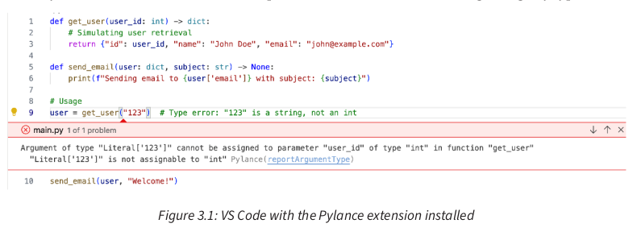
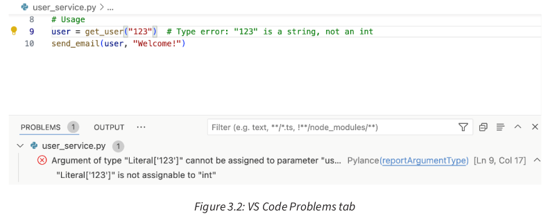

<div dir="rtl" style="text-align: right;">


### 3 - پایتون با قابلیت‌های نوع پیشرفته: تقویت معماری پاک

این فصل با بنا گذاشتن بر مبانی **اصول SOLID** و **معماری پاک** که در فصل‌های قبلی بررسی شد، به یک ویژگی قدرتمند در پایتون می‌پردازد: **راهنمایی نوع** (Type Hinting) [237، 238]. با اینکه تایپینگ پویا در پایتون انعطاف‌پذیری زیادی ارائه می‌دهد، اما می‌تواند در پروژه‌های پیچیده منجر به خطاهای غیرمنتظره شود. راهنمایی نوع، راه‌حلی است که مزایای تایپینگ پویا را با **قوت بررسی نوع ایستا** ترکیب می‌کند.

این فصل نشان می‌دهد که چگونه راهنمایی نوع، پیاده‌سازی‌های معماری پاک را بهبود می‌بخشد، کد را خود-مستندساز و کمتر مستعد خطا می‌کند. همچنین، چگونگی پشتیبانی راهنمایی نوع از اصول SOLID، به ویژه در ایجاد رابط‌های واضح و تقویت **اصل وارونگی وابستگی (DIP)** را نیز بررسی می‌کند.

در پایان این فصل، شما درک خواهید کرد که چگونه از راهنمایی نوع به طور مؤثر در پروژه‌های پایتون استفاده کنید و کدهایی بنویسید که مستحکم‌تر، قابل نگهداری‌تر و در راستای اصول معماری پاک باشند. این دانش برای ساخت سیستم‌های پیچیده و مقیاس‌پذیر در فصل‌های بعدی حیاتی خواهد بود.

**موضوعات اصلی این فصل عبارتند از:**
* درک آگاهی از نوع در محیط پویای پایتون (Understanding type awareness in Python’s dynamic environment)
* بهره‌گیری از سیستم نوع‌بندی پایتون (Leveraging Python’s typing system)
* بهره‌گیری از ابزارهای بررسی نوع استاتیک خودکار (Leveraging automated static type-checking tools)

---

### **درک آگاهی از نوع در محیط پویای پایتون**

**نیازمندی‌های فنی:**
* مثال‌های کد این فصل و سایر بخش‌های کتاب با **پایتون 3.13** تست شده‌اند.
* تمام مثال‌ها در مخزن گیت‌هاب کتاب موجود هستند.
* این فصل به **Visual Studio Code (VS Code)** اشاره می‌کند.

برای درک کامل سیستم نوع‌بندی پایتون، مهم است که بین زبان‌های با **نوع‌بندی پویا** مانند پایتون و زبان‌های با **نوع‌بندی ایستا** مانند جاوا یا ++C تفاوت قائل شویم. در زبان‌های نوع‌بندی ایستا، متغیرها دارای نوع ثابتی هستند که در زمان کامپایل تعیین می‌شود. پایتون، به عنوان یک زبان با نوع‌بندی پویا، به متغیرها اجازه می‌دهد در زمان اجرا تغییر نوع دهند، که این امر انعطاف‌پذیری زیادی را فراهم می‌کند اما چالش‌های بالقوه‌ای را نیز به همراه دارد. این نوع‌بندی پویا هم یک مزیت و هم یک چالش در پیاده‌سازی معماری پاک است؛ در حالی که انعطاف‌پذیری و توسعه سریع را فراهم می‌کند، می‌تواند منجر به رابط‌های نامشخص و وابستگی‌های پنهان نیز شود، که معماری پاک قصد دارد این مشکلات را برطرف کند.

#### **تکامل نوع‌بندی در پایتون**

رویکرد پایتون به نوع‌بندی در طول زمان به طور قابل توجهی تکامل یافته است. در حالی که در ابتدا یک زبان کاملاً با نوع‌بندی پویا بود، پایتون با اضافه شدن **دستور زبان راهنمایی نوع (Type Hinting)** در **پایتون 3.5 (PEP 484)**، نوع‌بندی ایستا اختیاری را معرفی کرد. این معرفی با افزایش پیچیدگی برنامه‌های پایتون، به ویژه در پروژه‌های بزرگ مقیاس که اصول معماری پاک در آن‌ها بیشترین مزیت را دارند، همراه بود.

استانداردسازی راهنمایی‌های نوع از طریق PEP 484 نقطه عطف مهمی در تکامل پایتون بود که رویکردی یکپارچه برای افزودن اطلاعات نوع به کد پایتون فراهم کرد. این امر راه را برای پذیرش گسترده‌تر بررسی نوع ایستا در اکوسیستم پایتون و توسعه ابزارها و IDE‌های مختلفی که از این اطلاعات راهنمایی نوع بهره می‌برند، هموار کرد.

رویکرد پایتون به راهنمایی نوع بخشی از یک روند گسترده‌تر در زبان‌های پویا است. به عنوان مثال، جاوااسکریپت شاهد ظهور TypeScript بوده است، که یک زیرمجموعه نوع‌بندی شده از جاوااسکریپت است که به جاوااسکریپت ساده کامپایل می‌شود. در حالی که هم پایتون و هم TypeScript قصد دارند مزایای نوع‌بندی ایستا را به زبان‌های پویا بیاورند، رویکردهای آن‌ها متفاوت است:
* **ادغام (Integration):** راهنمایی‌های نوع پایتون در خود زبان تعبیه شده‌اند، در حالی که TypeScript یک زبان جداگانه است که به جاوااسکریپت کامپایل می‌شود.
* **اختیاری بودن (Optionality):** راهنمایی‌های نوع پایتون کاملاً اختیاری هستند و می‌توانند به تدریج پذیرفته شوند، در حالی که TypeScript بررسی نوع را با سخت‌گیری بیشتری اعمال می‌کند.

موفقیت TypeScript در اکوسیستم جاوااسکریپت، ارزش افزودن اطلاعات نوع به زبان‌های پویا را بیشتر تأیید می‌کند. هم راهنمایی‌های نوع پایتون و هم TypeScript نشان می‌دهند که چگونه ترکیب انعطاف‌پذیری نوع‌بندی پویا با استحکام نوع‌بندی ایستا می‌تواند منجر به پایگاه‌های کد قابل نگهداری‌تر و مقیاس‌پذیرتر شود.

تکامل راهنمایی نوع در پایتون توسط عوامل مهمی هدایت شد. این تکامل به طور قابل توجهی خوانایی کد را بهبود می‌بخشد و به عنوان نوعی خود-مستندسازی عمل می‌کند و درک هدف استفاده از متغیرها و توابع را برای توسعه‌دهندگان آسان‌تر می‌کند. این وضوح بهبود یافته به ویژه در حفظ تفکیک نگرانی‌ها در معماری پاک ارزشمند است. راهنمایی‌های نوع همچنین پشتیبانی از IDE و ابزارها را بهبود می‌بخشند و تکمیل دقیق‌تر کد و تشخیص خطا را تسهیل می‌کنند. این پشتیبانی ابزاری بهبود یافته هنگام کار با معماری‌های پیچیده حیاتی است و به توسعه‌دهندگان کمک می‌کند تا بین لایه‌ها و اجزای مختلف با کارایی بیشتری حرکت کنند.

علاوه بر این، راهنمایی نوع، refactoring و نگهداری پایگاه‌های کد بزرگ را به طور قابل توجهی آسان‌تر می‌کند. در زمینه معماری پاک، که ما تلاش می‌کنیم سیستم‌هایی ایجاد کنیم که با تغییرات سازگار باشند، این مزیت اهمیت ویژه‌ای دارد. راهنمایی‌های نوع به عنوان یک **شبکه ایمنی** در طول تلاش‌های refactoring در مقیاس بزرگ عمل می‌کنند و به اطمینان از اینکه تغییرات در یک بخش از سیستم به طور ناخواسته رابط‌ها یا انتظارات در بخش دیگری را خراب نمی‌کند، کمک می‌کنند.

شاید مهمتر از همه برای پیاده‌سازی‌های معماری پاک ما، راهنمایی‌های نوع به ما امکان می‌دهند انواع خاصی از خطاها را در مراحل اولیه فرآیند توسعه شناسایی کنیم. با صراحت بیان کردن اهداف خود از طریق توضیحات نوع، می‌توانیم مشکلات احتمالی را در زمان طراحی یا در طول تحلیل ایستا شناسایی کنیم، به جای اینکه در زمان اجرا با آن‌ها روبرو شویم. این تشخیص زودهنگام خطا کاملاً با هدف معماری پاک در ایجاد سیستم‌های مستحکم و قابل نگهداری همسو است.

همانطور که در بخش‌های بعدی به جزئیات راهنمایی نوع می‌پردازیم، به یاد داشته باشید که این ویژگی‌ها ابزارهایی برای بهبود پیاده‌سازی‌های پایتون ما از معماری پاک هستند. آن‌ها راهی را برای صریح‌تر کردن مرزهای معماری ما و خود-مستندساز کردن کدهایمان ارائه می‌دهند، در حالی که انعطاف‌پذیری و قدرت بیان پایتون را حفظ می‌کنند.

#### **نوع‌بندی پویا در مقابل راهنمایی نوع**

برای درک اهمیت راهنمایی نوع در پایتون، تمایز بین نوع‌بندی پویای بنیادین پایتون و نقش راهنمایی نوع حیاتی است. این دو مفهوم اهداف متفاوتی را دنبال می‌کنند و در مراحل مختلف فرآیند توسعه عمل می‌کنند.

**نوع‌بندی پویا:**
در یک زبان با نوع‌بندی پویا مانند پایتون، متغیرها می‌توانند مقادیری از هر نوعی را نگه دارند و این انواع می‌توانند در زمان اجرا تغییر کنند. این انعطاف‌پذیری یک ویژگی اصلی پایتون است.

</div>


```python
x = 5        # x is an integer
x = "hello"  # Now x is a string
```
<div dir="rtl" style="text-align: right;">

این انعطاف‌پذیری امکان توسعه سریع و کد بیانگر را فراهم می‌کند، اما اگر با دقت مدیریت نشود، می‌تواند منجر به خطاهای زمان اجرا شود. مثال زیر را در نظر بگیرید:

</div>


```python
def add_numbers(a, b):
    return a + b
# Works fine, result is 8:
result = add_numbers(5, 3)
# Raises TypeError: unsupported operand type(s) for +: 'int' and 'str':
result = add_numbers(5, "3")
```

<div dir="rtl" style="text-align: right;">


در این حالت، تابع `add_numbers` وقتی دو عدد صحیح به آن داده می‌شود، همانطور که انتظار می‌رود کار می‌کند، اما وقتی یک عدد صحیح و یک رشته به آن داده می‌شود، یک `TypeError` را ایجاد می‌کند. این خطا تنها در زمان اجرا رخ می‌دهد، که اگر در بخش حیاتی برنامه شما باشد یا توسط فرآیند تست شما شناسایی نشود، می‌تواند مشکل‌ساز باشد.

**راهنمایی نوع (Type Hinting):**
راهنمایی‌های نوع به توسعه‌دهندگان اجازه می‌دهند تا متغیرها و پارامترهای توابع را علاوه بر مقادیر برگشتی، با انواع مورد انتظار خود مشخص کنند. در مورد راهنمایی نوع، بیایید تابع ساده خود را برای جمع اعداد دوباره بررسی کنیم:

</div>


```python
def add_numbers(a: int, b: int) -> int:
    return a + b
# Works fine, result is 8:
result = add_numbers(5, 3)
# IDE or type checker would flag this as an error:
result = add_numbers(5, "3")
```

<div dir="rtl" style="text-align: right;">


اجزای دستور زبان راهنمایی نوع در این تابع را بررسی کنیم:
*   `a: int` و `b: int`: این توضیحات نشان می‌دهند که انتظار می‌رود هر دو `a` و `b` عدد صحیح باشند. علامت دو نقطه (:) برای جدا کردن نام پارامتر از نوع آن استفاده می‌شود.
*   `-> int`: این علامت پیکان پس از لیست پارامترهای تابع، نوع برگشتی را مشخص می‌کند. در این حالت، نشان می‌دهد که انتظار می‌رود `add_numbers` یک عدد صحیح برگرداند.

این توضیحات نوع، اطلاعات واضحی در مورد ورودی‌ها و خروجی مورد انتظار تابع ارائه می‌دهند، که کد را خود-مستندتر و درک آن را آسان‌تر می‌کند.

نکات کلیدی در مورد راهنمایی نوع عبارتند از:
*   آن‌ها بر رفتار زمان اجرای پایتون تأثیر نمی‌گذارند. پایتون همچنان به صورت پویا نوع‌بندی می‌شود.
*   آن‌ها به عنوان مستندات عمل می‌کنند و اهداف کد را روشن‌تر می‌سازند.
*   آن‌ها ابزارهای تحلیل ایستا را قادر می‌سازند تا خطاهای احتمالی مرتبط با نوع را قبل از زمان اجرا تشخیص دهند.
*   آن‌ها پشتیبانی IDE را برای تکمیل کد و refactoring بهبود می‌بخشند.

راهنمایی‌های نوع، قدرت ابزارهای تحلیل ایستا را برای تشخیص خطاهای احتمالی قبل از زمان اجرا آزاد می‌کنند. در حالی که خود پایتون نحو (syntax) راهنمایی‌های نوع را فراهم می‌کند، اما آن‌ها را در زمان اجرا اعمال نمی‌کند. مفسر پایتون، راهنمایی‌های نوع را به عنوان فراداده‌های تزئینی (decorative metadata) در نظر می‌گیرد. این ابزارهای شخص ثالث مانند **mypy** یا **pyright** هستند که بررسی نوع ایستا واقعی را انجام می‌دهند. این ابزارها کد شما را بدون اجرای آن، با استفاده از راهنمایی‌های نوع برای استنتاج و بررسی انواع در کل پایگاه کد شما، تحلیل می‌کنند. آن‌ها می‌توانند به عنوان دستورات مستقل اجرا شوند، برای بازخورد در زمان واقعی در IDE‌ها ادغام شوند، یا در خطوط لوله یکپارچه‌سازی پیوسته (CI/CD) گنجانده شوند، که امکان بررسی نوع را در مراحل مختلف توسعه فراهم می‌کنند.

#### **آگاهی از نوع در معماری پاک**

معرفی راهنمایی نوع به ویژه برای معماری پاک مرتبط است. در فصل قبلی، در مورد اهمیت رابط‌های واضح و وارونگی وابستگی صحبت کردیم. راهنمایی نوع می‌تواند نقش حیاتی در دستیابی به این اهداف ایفا کند و مرزهای معماری ما را صریح‌تر و نگهداری آن‌ها را آسان‌تر کند.

به این مثال با استفاده از شیء `Shape` از فصل 2، با بهره‌گیری کامل‌تر از راهنمایی نوع توجه کنید:

</div>


```python
from abc import ABC, abstractmethod
import math
class Shape(ABC):
    @abstractmethod
    def area(self) -> float:
        pass
class Rectangle(Shape):
    def __init__(self, width: float, height: float) -> None:
        self.width = width
        self.height = height
    def area(self) -> float:
        return self.width * self.height
class Circle(Shape):
    def __init__(self, radius: float) -> None:
        self.radius = radius
    def area(self) -> float:
        return math.pi * self.radius ** 2
class AreaCalculator:
    def calculate_area(self, shape: Shape) -> float:
        return shape.area()
```

<div dir="rtl" style="text-align: right;">


این مثال را دقیق‌تر بررسی کنیم:
*   متد `area` در کلاس `Shape` با حاشیه نویسی `float` برای برگشتی، به وضوح نوع برگشتی مورد انتظار را برای تمام پیاده‌سازی‌های `Shape` مشخص می‌کند.
*   کلاس‌های `Rectangle` و `Circle` مشخص می‌کنند که سازنده‌های آن‌ها انتظار پارامترهای `float` را دارند و `None` را برمی‌گردانند. این حاشیه نویسی `-> None` به صراحت نشان می‌دهد که سازنده‌ها مقداری برنمی‌گردانند، که در پایتون ضمنی است اما از طریق راهنمایی نوع واضح می‌شود.
*   متدهای `area` در `Rectangle` و `Circle` با حاشیه نویسی `float` برای برگشتی، به قرارداد تعریف شده در کلاس پایه انتزاعی `Shape` پایبند هستند.
*   کلاس `AreaCalculator` به صراحت بیان می‌کند که متد `calculate_area` آن یک شیء `Shape` را به عنوان آرگومان انتظار دارد و `float` برمی‌گرداند.

این راهنمایی‌های نوع، رابط‌ها را صریح‌تر می‌کنند و به حفظ مرزهای معماری پاک بین اجزا کمک می‌کنند. توجه به این نکته مهم است که این راهنمایی‌های نوع در زمان اجرا چیزی را اعمال نمی‌کنند. بلکه آن‌ها به عنوان مستندات عمل می‌کنند و ابزارهای تحلیل ایستا را قادر می‌سازند تا خطاهای احتمالی نوع را قبل از اجرا تشخیص دهند.

آن‌ها چندین مزیت را در زمینه معماری پاک فراهم می‌کنند:
*   **رابط‌های واضح (Clear interfaces):** راهنمایی‌های نوع، قراردادها بین لایه‌های مختلف معماری شما را صریح می‌کنند. در مثال ما، واضح است که هر `Shape` باید یک متد `area` داشته باشد که یک `float` برمی‌گرداند.
*   **وارونگی وابستگی (Dependency inversion):** آن‌ها با تعریف واضح رابط‌های انتزاعی که ماژول‌های سطح بالاتر به آن‌ها وابسته هستند، به اعمال قانون وابستگی (Dependency Rule) کمک می‌کنند. `AreaCalculator` به `Shape` انتزاعی وابسته است، نه به پیاده‌سازی‌های واقعی.
*   **قابلیت تست (Testability):** راهنمایی‌های نوع ایجاد و استفاده از اشیاء Mock را که با رابط‌های مورد انتظار مطابقت دارند، آسان‌تر می‌کنند. برای تست، می‌توانیم به راحتی یک `Shape` Mock ایجاد کنیم که به الزامات رابط مستند شده پایبند باشد.
*   **قابلیت نگهداری (Maintainability):** با رشد پروژه شما، راهنمایی‌های نوع به عنوان مستندات زنده عمل می‌کنند و درک و تغییر کد را برای توسعه‌دهندگان آسان‌تر می‌کنند. آن‌ها بینش فوری در مورد انواع مورد انتظار پارامترهای متد و مقادیر برگشتی ارائه می‌دهند.

با بهره‌گیری از راهنمایی نوع به این روش، ما یک پیاده‌سازی مستحکم‌تر از معماری پاک ایجاد می‌کنیم. رابط‌های مستند شده صریح و وابستگی‌های واضح، کدهای ما را خود-مستندتر می‌کنند و به تشخیص زودهنگام مسائل مرتبط با نوع از طریق تحلیل ایستا کمک می‌کنند. با ساخت سیستم‌های پیچیده‌تر، این مزایا انباشته می‌شوند و منجر به یک پایگاه کد می‌شوند که درک، تغییر و گسترش آن آسان‌تر است.

#### **چالش‌ها و ملاحظات**

هنگام استفاده از راهنمایی نوع در پروژه‌های پایتون، آگاهی از چندین ملاحظه کلیدی مهم است:
*   آن‌ها نیاز به تست و مدیریت خطای مناسب را برطرف نمی‌کنند.
*   یک منحنی یادگیری برای توسعه‌دهندگان تازه وارد به مفاهیم نوع‌بندی ایستا وجود دارد.
*   ادغام برنامه‌ریزی شده در جریان کار توسعه تیم شما و خط لوله CI/CD برای پذیرش موفقیت‌آمیز ضروری است.

همانطور که در بخش‌های بعدی و ادامه کتاب به جزئیات سیستم نوع‌بندی پایتون می‌پردازیم، خواهیم دید که چگونه می‌توان از این ویژگی‌ها برای ایجاد پیاده‌سازی‌های معماری پاک مستحکم‌تر، قابل نگهداری‌تر و خود-مستندتر استفاده کرد. خواهیم دید که چگونه آگاهی از نوع می‌تواند به ما در ایجاد مرزهای واضح‌تر بین لایه‌های معماری، صریح‌تر کردن وابستگی‌هایمان و تشخیص زودهنگام مشکلات احتمالی در فرآیند توسعه کمک کند.

به یاد داشته باشید، هدف تبدیل پایتون به یک زبان با نوع‌بندی ایستا نیست، بلکه استفاده از آگاهی از نوع به عنوان ابزاری برای بهبود طراحی‌های معماری پاک ما است. در پایان این فصل، شما درک کاملی از چگونگی تعادل بخشیدن به ماهیت پویای پایتون با مزایای آگاهی از نوع در پیاده‌سازی‌های معماری پاک خود خواهید داشت.

---

### **بهره‌گیری از سیستم نوع‌بندی پایتون**

در حوزه معماری پاک، نقش یک سیستم نوع‌بندی قوی فراتر از صرف جلوگیری از خطا است. این سیستم به عنوان ابزاری قدرتمند برای بیان و اعمال مرزهای معماری، پشتیبانی از اصول کلیدی مانند انتزاع (abstraction)، چندریختی (polymorphism) و وارونگی وابستگی (dependency inversion) عمل می‌کند. سیستم نوع‌بندی پایتون، هنگامی که به طور مؤثر مورد استفاده قرار گیرد، به یک دارایی ارزشمند در پیاده‌سازی این مفاهیم حیاتی تبدیل می‌شود.

همانطور که شروع به بررسی ویژگی‌های پیشرفته‌تر سیستم نوع‌بندی پایتون می‌کنیم، خواهیم دید که چگونه آن‌ها می‌توانند پیاده‌سازی‌های معماری پاک ما را به طور قابل توجهی بهبود بخشند. این ویژگی‌ها به ما امکان می‌دهند رابط‌های بیانگرتر و دقیق‌تری بین لایه‌های مختلف برنامه‌مان ایجاد کنیم، که منجر به کدی می‌شود که نه تنها مستحکم‌تر است، بلکه خود-مستندتر و قابل نگهداری‌تر نیز می‌باشد.

در این بخش، طیف وسیعی از ویژگی‌های نوع‌بندی را از نام‌های مستعار نوع (type aliases) و انواع Union تا انواع Literal و TypedDict بررسی خواهیم کرد. سپس خواهیم دید که چگونه می‌توان این‌ها را برای پشتیبانی از اصول SOLID در طراحی‌های معماری پاک خود به کار برد. در پایان این بخش، شما درک جامعی از نحوه استفاده از سیستم نوع‌بندی پایتون برای ایجاد مرزهای معماری پاک‌تر و قابل نگهداری‌تر خواهید داشت.

با بررسی راهنمایی نوع پایه شروع خواهیم کرد، سپس به ویژگی‌های پیشرفته‌تر می‌پردازیم و در نهایت خواهیم دید که چگونه این ویژگی‌ها از اصول SOLID در زمینه معماری پاک پشتیبانی می‌کنند.

#### **راهنمایی نوع پایه: از انواع ساده تا کانتینرها**

قبلاً نحوه استفاده از راهنمایی نوع پایه برای انواع ساده را دیده‌ایم. بیایید به سرعت نحو (syntax) آن را مرور کنیم:
*   برای اعداد صحیح: `count: int`
*   برای اعداد اعشاری: `price: float`
*   برای رشته‌ها: `name: str`
*   برای بولین‌ها: `is_active: bool`
*   برای حاشیه‌نویسی‌های تابع: از الگوی `def function_name(parameter: type) -> return_type:` پیروی کنید.

حالا بیایید ببینیم چگونه می‌توانیم از راهنمایی نوع با انواع کانتینر مانند لیست‌ها و دیکشنری‌ها استفاده کنیم:

</div>


```python
def process_order(items: list[str],
                  quantities: list[int]) -> dict[str, int]:
    return {item: quantity for item,
            quantity in zip(items, quantities)}
# Usage
order = process_order(['apple', 'banana', 'orange'],)
print(order)
# Output: {'apple': 2, 'banana': 3, 'orange': 1}
```

<div dir="rtl" style="text-align: right;">


این مثال را دقیق‌تر بررسی کنیم:
*   `list[str]` نشان می‌دهد که `items` باید یک لیست از رشته‌ها باشد.
*   `list[int]` مشخص می‌کند که `quantities` باید یک لیست از اعداد صحیح باشد.
*   `-> dict[str, int]` به ما می‌گوید که تابع یک دیکشنری با کلیدهای رشته‌ای و مقادیر صحیح برمی‌گرداند.

این راهنمایی‌های نوع، اطلاعات واضحی در مورد ساختار مورد انتظار داده‌های ورودی و خروجی ارائه می‌دهند، که به ویژه در معماری پاک، جایی که ما اغلب با ساختارهای داده پیچیده بین لایه‌های مختلف برنامه سروکار داریم، ارزشمند است.

در معماری پاک، چنین راهنمایی‌های نوعی به ویژه هنگام تعریف رابط‌ها بین لایه‌های مختلف برنامه مفید هستند. آن‌ها یک قرارداد واضح برای انتقال داده‌ها بین لایه **دامنه (Domain layer)**، **موارد استفاده (use cases)** و رابط‌های خارجی فراهم می‌کنند، که به حفظ مرزهای پاک و کاهش خطر ناهماهنگی داده‌ها کمک می‌کند.

همانطور که پیش می‌رویم، خواهیم دید که چگونه ویژگی‌های پیشرفته‌تر نوع‌بندی می‌توانند توانایی ما را برای بیان روابط و محدودیت‌های پیچیده بیشتر افزایش دهند و از پیاده‌سازی‌های قوی معماری پاک در پایتون پشتیبانی کنند.

#### **`Sequence`: انعطاف‌پذیری در انواع مجموعه**

راهنمایی نوع `Sequence` از ماژول `typing` ابزاری قدرتمند برای بیان مجموعه‌ها به روشی است که به خوبی با اصول SOLID، به ویژه **اصل جایگزینی لیسکوف (Liskov Substitution Principle)** و **اصل باز-بسته (Open-Closed Principle)**، همسو است.

مثالی از کاربرد آن در زیر آورده شده است:

</div>


```python
from typing import Sequence
def calculate_total(items: Sequence[float]) -> float:
    return sum(items)
# Usage
print(calculate_total([1.0, 2.0, 3.0]))  # Works with list
print(calculate_total((4.0, 5.0, 6.0)))  # Also works with tuple
```

<div dir="rtl" style="text-align: right;">


**چرا گاهی `list` و گاهی `List` در کد پایتون دیده می‌شود؟**
ممکن است متوجه شوید که برخی از کدهای پایتون از `list` (حروف کوچک) و برخی دیگر از `List` (حرف بزرگ) برای حاشیه‌نویسی نوع استفاده می‌کنند. این به این دلیل است که پشتیبانی از انواع عمومی توکار در پایتون 3.9 معرفی شد. قبل از آن، برای نوع `List` لازم بود آن را از پکیج `typing` وارد کنید. برای کد در پایتون 3.9 به بالا، می‌توانید به سادگی از نام‌های مجموعه‌های توکار مانند `list` و `dict` استفاده کنید.

استفاده از `Sequence` به جای یک نوع خاص مانند `List` یا `Tuple` چندین مزیت ارائه می‌دهد:
*   **اصل جایگزینی لیسکوف (Liskov Substitution Principle):** `Sequence` به تابع اجازه می‌دهد با هر نوع دنباله‌ای (لیست‌ها، تاپل‌ها و کلاس‌های دنباله سفارشی) کار کند بدون اینکه قرارداد را نقض کند.
*   **اصل باز-بسته (Open-Closed Principle):** تابع `calculate_total` برای گسترش باز است (می‌تواند با انواع دنباله جدید کار کند) اما برای تغییر بسته است (نیازی به تغییر تابع برای پشتیبانی از انواع جدید نداریم).
*   **اصل تفکیک رابط (Interface Segregation Principle):** با استفاده از `Sequence`، ما فقط حداقل رابط مورد نیاز (تکرار بر روی عناصر) را می‌خواهیم، به جای اینکه به یک نوع مجموعه خاص با متدهای بالقوه غیرضروری متعهد شویم.

در معماری پاک، راهنمایی نوع `Sequence` در لایه‌های مختلف ارزشمند است. در لایه **مورد استفاده (Use Case layer)**، پردازش مجموعه‌ای از موجودیت‌ها یا اشیاء ارزشی را تسهیل می‌کند. در لایه **آداپتورهای رابط (Interface Adapters layer)**، API‌های انعطاف‌پذیر را قادر می‌سازد که با انواع مختلف مجموعه کار کنند. در لایه **دامنه (Domain layer)**، `Sequence` نیاز به یک مجموعه را بدون مشخص کردن پیاده‌سازی آن بیان می‌کند و تفکیک نگرانی‌ها را حفظ می‌کند. این تطبیق‌پذیری، `Sequence` را به ابزاری قدرتمند برای ایجاد پیاده‌سازی‌های معماری پاک قابل نگهداری و تطبیق‌پذیر در پایتون تبدیل می‌کند.

#### **انواع `Union` و `Optional`**

در معماری پاک، ما اغلب نیاز به مدیریت چندین نوع ممکن یا مقادیر اختیاری داریم، به ویژه در مرزهای بین لایه‌ها. انواع `Union` و `Optional` برای این سناریوها عالی هستند:

</div>


```python
from typing import Union, Optional
def process_input(data: Union[str, int]) -> str:
    return str(data)
def find_user(user_id: Optional[int] = None) -> Optional[str]:
    if user_id is None:
        return None
    # ... logic to find user ...
    return "User found"
# Usage
result1 = process_input("Hello")  # Works with str
result2 = process_input(42)       # Works with int
user = find_user()                # Optional parameter
```

<div dir="rtl" style="text-align: right;">


انواع `Union` به یک مقدار اجازه می‌دهند که یکی از چندین نوع باشد، در حالی که `Optional` یک مخفف برای `Union[Some_Type, None]` است. این ساختارها به ویژه در معماری پاک برای ایجاد رابط‌های انعطاف‌پذیر بین لایه‌ها و در عین حال حفظ ایمنی نوع مفید هستند.

باید توجه داشت که در پایتون 3.10 به بالا، نحو (syntax) Union به استفاده فشرده از کاراکتر خط لوله (`|`) ساده شد:

</div>


```python
def process_input(data: Union[str, int]) -> str:
```

<div dir="rtl" style="text-align: right;">


خط بالا به صورت زیر ساده می‌شود:

</div>


```python
def process_input(data: str | int) -> str:
```

<div dir="rtl" style="text-align: right;">


#### **انواع `Literal`**

انواع `Literal` به ما اجازه می‌دهند مقادیر دقیقی را که یک متغیر می‌تواند بپذیرد، مشخص کنیم. این امر به ویژه در معماری پاک برای اعمال مقادیر خاص در مرزهای رابط مفید است:

</div>


```python
from typing import Literal
LogLevel = Literal["DEBUG", "INFO", "WARNING", "ERROR"]
def set_log_level(level: LogLevel) -> None:
    print(f"Setting log level to {level}")
# Usage
set_log_level("DEBUG")  # Valid
set_log_level("CRITICAL")  # Type checker would flag this as an error
```

<div dir="rtl" style="text-align: right;">


انواع `Literal` به ایجاد رابط‌های دقیق‌تر کمک می‌کنند و احتمال انتشار داده‌های نامعتبر در سیستم را کاهش می‌دهند. این امر به خوبی با تأکید معماری پاک بر مرزها و قراردادهای واضح بین لایه‌ها همسو است.

#### **نام‌های مستعار نوع (Type aliases)**

نام‌های مستعار نوع به ساده‌سازی حاشیه‌نویسی‌های نوع پیچیده کمک می‌کنند و کد ما را خواناتر و قابل نگهداری‌تر می‌کنند. این امر به ویژه در معماری پاک هنگام کار با مدل‌های دامنه پیچیده یا اشیاء انتقال داده (DTOs) مفید است.

مثال زیر را در نظر بگیرید:

</div>


```python
# Type aliases
UserDict = dict[str, str]
UserList = list[UserDict]
def process_users(users: UserList) -> None:
    for user in users:
        print(f"Processing user: {user['name']}")
# Usage
users: UserList = [{"name": "Alice"}, {"name": "Bob"}]
process_users(users)
```

<div dir="rtl" style="text-align: right;">


این کد را دقیق‌تر بررسی کنیم:
*   `UserDict` یک نام مستعار نوع برای `dict[str, str]` است که یک شیء کاربر با کلیدها و مقادیر رشته‌ای را نشان می‌دهد.
*   `UserList` یک نام مستعار نوع برای `list[UserDict]` است که لیستی از دیکشنری‌های کاربر را نشان می‌دهد.

نام‌های مستعار نوع، نام‌های خواناتری برای انواع پیچیده ارائه می‌دهند و وضوح کد را بدون ایجاد انواع جدید بهبود می‌بخشند. آن‌ها ما را قادر می‌سازند کدی بنویسیم که هم بیانگر باشد و هم با اصول معماری پاک، که تفکیک نگرانی‌ها، قابلیت نگهداری و وضوح را ترویج می‌کند، همسو باشد.

#### **`NewType`**

`NewType` انواع متمایز ایجاد می‌کند و ایمنی نوع اضافی را فراهم می‌کند. این در معماری پاک برای تعریف مفاهیم دامنه واضح ارزشمند است:

</div>


```python
from typing import NewType
UserId = NewType('UserId', int)
ProductId = NewType('ProductId', int)
def process_order(user_id: UserId,
                  product_id: ProductId) -> None:
    print(f"Processing order for User {user_id} and Product {product_id}")
# Usage
user_id = UserId(1)
product_id = ProductId(1)  # Same underlying int, but distinct type
process_order(user_id, product_id)
# This would raise a type error:
# process_order(product_id, user_id)
```

<div dir="rtl" style="text-align: right;">


`NewType` انواع متمایزی ایجاد می‌کند که توسط بررسی‌کننده‌های نوع ایستا شناسایی می‌شوند و از ترکیب تصادفی مقادیر مشابه اما از نظر مفهومی متفاوت جلوگیری می‌کنند. این به تشخیص زودهنگام خطاهای احتمالی در فرآیند توسعه کمک می‌کند و ایمنی نوع کلی پیاده‌سازی معماری پاک شما را افزایش می‌دهد.

هم نام‌های مستعار نوع و هم `NewType` به خوبی با اصول معماری پاک همسو هستند، با بهبود خوانایی کد، اطمینان از ایمنی نوع در مرزهای لایه و تعریف واضح مفاهیم دامنه. این منجر به پیاده‌سازی‌های معماری پاک بیانگرتر، با ایمنی نوع بالاتر و قابل نگهداری‌تر در پایتون می‌شود.

#### **نوع `Any`**

نوع `Any` یک راهنمایی نوع خاص است که اساساً به بررسی‌کننده نوع می‌گوید هر نوعی را مجاز بداند. زمانی استفاده می‌شود که می‌خواهید نشان دهید یک متغیر می‌تواند از هر نوعی باشد، یا زمانی که با کدی سروکار دارید که نوع آن واقعاً مشخص نیست یا می‌تواند به شدت متفاوت باشد. استفاده از آن را در این مثال عمومی لاگ‌نویسی می‌بینیم:

</div>


```python
from typing import Any
def log_data(data: Any) -> None:
    print(f"Logged: {data}")
# Usage
log_data("A string")
log_data(42)
log_data({"key": "value"})
```

<div dir="rtl" style="text-align: right;">


در معماری پاک، ما عموماً قصد داریم تا حد امکان در مورد انواع، به ویژه در مرزهای لایه، خاص باشیم. نوع `Any` باید به عنوان آخرین راه حل در نظر گرفته شود، که اغلب نشان‌دهنده نیاز به refactoring یا تعریف نوع خاص‌تر است. این نوع بیشتر زمانی مناسب است که با سیستم‌های خارجی در ارتباط هستیم که نوع آن واقعاً ناشناخته یا بسیار متغیر است. در کد خودتان، استفاده از `Any` را به عنوان نشانه‌ای برای refactoring کد به سمت استفاده از انواع خاص به جای استفاده از نوع همه‌گیر `Any` در نظر بگیرید.

این ویژگی‌های پیشرفته نوع‌بندی ابزارهای قدرتمندی برای پیاده‌سازی معماری پاک در پایتون فراهم می‌کنند. آن‌ها به ما امکان می‌دهند رابط‌های بیانگرتر، دقیق‌تر و خود-مستندتر را بین لایه‌های مختلف برنامه خود ایجاد کنیم. همانطور که پیش می‌رویم، خواهیم دید که چگونه می‌توان این ویژگی‌ها را برای پشتیبانی از اصول SOLID در طراحی‌های معماری پاک خود به کار برد.

---

### **بهره‌گیری از ابزارهای بررسی نوع استاتیک خودکار**

همانطور که سیستم نوع‌بندی پایتون و مزایای آن برای معماری پاک را بررسی کردیم، درک نحوه اعمال مؤثر این راهنمایی‌های نوع در عمل، حیاتی است. پایتون، به عنوان یک زبان با نوع‌بندی پویا، بررسی نوع را در زمان اجرا اعمال نمی‌کند. اینجاست که ابزارهای بررسی نوع استاتیک خودکار وارد عمل می‌شوند و شکاف بین ماهیت پویای پایتون و مزایای نوع‌بندی ایستا را پر می‌کنند.

این رویکرد چندین مزیت کلیدی را ارائه می‌دهد:
*   **تشخیص زودهنگام خطا (Early error detection):** مسائل مرتبط با نوع را قبل از زمان اجرا تشخیص می‌دهد و احتمال وجود باگ در تولید را کاهش می‌دهد.
*   **بهبود کیفیت کد (Improved code quality):** استفاده سازگار از انواع در سراسر پروژه را اعمال می‌کند که منجر به کدی مستحکم‌تر و خود-مستندتر می‌شود.
*   **refactoring پیشرفته (Enhanced refactoring):** تغییرات کد در مقیاس بزرگ را با اطمینان بیشتری انجام می‌دهد، زیرا بررسی‌کننده نوع می‌تواند بسیاری از مکان‌هایی را که نیاز به به‌روزرسانی دارند شناسایی کند.
*   **پشتیبانی بهتر IDE (Better IDE support):** تکمیل کد دقیق‌تر، ناوبری و ابزارهای refactoring در محیط توسعه شما را فعال می‌کند.

این مزایا به ویژه در پیاده‌سازی‌های معماری پاک، جایی که حفظ مرزهای واضح بین لایه‌ها و اطمینان از صحت جریان داده‌ها بسیار مهم است، ارزشمند هستند. در این بخش، بر نحوه استفاده از این ابزارهای خودکار برای اعمال سازگاری نوع، تشخیص زودهنگام خطاها و بهبود تجربه کلی توسعه تمرکز خواهیم کرد. ما از رابط خط فرمان (CLI) **mypy** استفاده خواهیم کرد، اما سپس از ابزار دیگری به عنوان افزونه‌ای برای IDE VS Code استفاده می‌کنیم.

#### **mypy CLI**

Mypy یک بررسی‌کننده نوع ایستا قدرتمند است که می‌تواند مستقیماً از خط فرمان اجرا شود. این امر ادغام آن را در جریان کار توسعه و خطوط لوله استقرار آسان می‌کند. بیایید نحوه استفاده از mypy و تفسیر خروجی آن را بررسی کنیم.

ابتدا، باید mypy را نصب کنید. از آنجایی که یک ماژول پایتون است، می‌توانید به راحتی آن را با استفاده از pip نصب کنید:

```bash
$ pip install mypy
```


پس از نصب، می‌توانید از mypy برای بررسی فایل‌های پایتون خود برای خطاهای نوع استفاده کنید. بیایید به یک مثال ساده نگاه کنیم. فرض کنید یک فایل پایتون به نام `user_service.py` با محتوای زیر دارید:

</div>


```python
def get_user(user_id: int) -> dict:
    # Simulating user retrieval
    return {"id": user_id,
            "name": "John Doe",
            "email": "john@example.com"}
def send_email(user: dict, subject: str) -> None:
    print(f"Sending email to {user['email']} with subject: {subject}")
# Usage
user = get_user("123")
send_email(user, "Welcome!")
```

<div dir="rtl" style="text-align: right;">


برای بررسی این فایل با mypy، دستور زیر را اجرا کنید:

```bash
$ mypy user_service.py
user_service.py:9: error: Argument 1 to "get_user" has incompatible type "str"; expected "int"  [arg-type]
Found 1 error in 1 file (checked 1 source file)
```

mypy چه چیزی به ما می‌گوید:
*   فایل (`user_service.py`) و شماره خط (9) که خطا در آن رخ داده را شناسایی می‌کند.
*   خطا را توصیف می‌کند: ما یک رشته ("123") را به `get_user` ارسال می‌کنیم، اما تابع انتظار یک عدد صحیح را دارد.
*   خطا را به عنوان یک مشکل `[arg-type]` دسته‌بندی می‌کند، که نشان‌دهنده مشکلی در انواع آرگومان‌ها است.

این خروجی بسیار ارزشمند است. یک عدم تطابق نوع را تشخیص می‌دهد که می‌تواند منجر به خطاهای زمان اجرا شود و به ما امکان می‌دهد قبل از اجرای کد، آن را برطرف کنیم.

می‌توانیم خطا را با تغییر `user = get_user("123")` به `user = get_user(123)` و سپس اجرای مجدد mypy اصلاح کنیم:

```bash
$ mypy user_service.py
Success: no issues found in 1 source file
```


اکنون، mypy هیچ مشکلی را گزارش نمی‌دهد، که تأیید می‌کند حاشیه‌نویسی‌های نوع ما با نحوه استفاده از توابع سازگار هستند.

#### **پیکربندی mypy**

در حالی که mypy به خوبی از ابتدا کار می‌کند، می‌توانید رفتار آن را با استفاده از یک فایل پیکربندی سفارشی کنید. این امر به ویژه برای پروژه‌های بزرگ یا زمانی که می‌خواهید به تدریج بررسی نوع را بپذیرید، مفید است.

یک فایل به نام `mypy.ini` در ریشه پروژه خود ایجاد کنید:

```ini
[mypy]
ignore_missing_imports = True
strict_optional = True
warn_redundant_casts = True
warn_unused_ignores = True
warn_return_any = True
warn_unreachable = True
```


این پیکربندی کارهای زیر را انجام می‌دهد:
*   نادیده گرفتن import‌های از دست رفته، که هنگام کار با کتابخانه‌های شخص ثالث بدون `type stub` مفید است.
*   فعال کردن بررسی سخت‌گیرانه انواع `Optional`.
*   هشدار در مورد `type cast`‌های اضافی و کامنت‌های `type: ignore` استفاده نشده.
*   هشدار زمانی که یک تابع به طور ضمنی `Any` را برمی‌گرداند.
*   هشدار در مورد کدهای غیرقابل دسترس.

با این پیکربندی، mypy بررسی جامع‌تری را ارائه می‌دهد و به شما در تشخیص طیف وسیع‌تری از مشکلات احتمالی در پیاده‌سازی معماری پاکتان کمک می‌کند. با اجرای منظم mypy به عنوان بخشی از فرآیند توسعه، می‌توانید مسائل مرتبط با نوع را زودهنگام تشخیص دهید و اطمینان حاصل کنید که لایه‌های معماری پاک شما به درستی با هم تعامل دارند و مرزهای مورد نظر خود را حفظ می‌کنند.

گزینه‌های پیکربندی برای mypy بسیار گسترده هستند و می‌توانند متناسب با نیازهای پروژه خاص شما سفارشی‌سازی شوند. برای لیست کاملی از گزینه‌های موجود و توضیحات آن‌ها، به مستندات رسمی mypy در آدرس https://mypy.readthedocs.io/en/stable/config_file.html مراجعه کنید.

#### **mypy در خطوط لوله استقرار**

ادغام mypy در خط لوله استقرار شما یک گام حیاتی در تضمین سازگاری نوع در سراسر پروژه شما است، به ویژه در زمینه معماری پاک که حفظ مرزهای واضح بین لایه‌ها بسیار مهم است.

در حالی که جزئیات پیاده‌سازی خاص ممکن است بسته به ابزار CI/CD انتخابی شما متفاوت باشد، مفهوم اساسی ثابت می‌ماند: **mypy را به عنوان بخشی از بررسی‌های خودکار خود قبل از استقرار کد خود اجرا کنید**. با توجه به اینکه mypy از طریق یک CLI ساده عمل می‌کند، ادغام آن در اکثر خطوط لوله استقرار نسبتاً ساده است.

به عنوان مثال، ممکن است بررسی‌های mypy را در موارد زیر اجرا کنید:
*   پس از هر `commit push`
*   به عنوان بخشی از اعتبارسنجی `pull request`
*   قبل از ادغام در شاخه اصلی
*   قبل از استقرار در محیط‌های staging یا تولید

این رویکرد به تشخیص مسائل مرتبط با نوع در مراحل اولیه فرآیند توسعه کمک می‌کند و احتمال ورود خطاهای نوع به محیط تولید را کاهش می‌دهد.

به عنوان یک مثال، در اینجا یک گردش کار ساده GitHub Actions که mypy و سپس تست‌های واحد را اجرا می‌کند، آورده شده است:


```yaml

name: Python Type Check and Test
on: [push, pull_request]
jobs:
  build:
    runs-on: ubuntu-latest
    steps:
    - uses: actions/checkout@v2
    - name: Set up Python
      uses: actions/setup-python@v2
      with:
        python-version: '3.13'
    - name: Install dependencies
      run: |
        python -m pip install --upgrade pip
        pip install mypy pytest
    - name: Run mypy
      run: mypy .
    - name: Run tests
      run: pytest
```


این گردش کار کارهای زیر را انجام می‌دهد:
*   در رویدادهای `push` یا `pull request` فعال می‌شود.
*   یک محیط پایتون را راه‌اندازی می‌کند.
*   وابستگی‌های لازم (از جمله mypy و pytest) را نصب می‌کند.
*   mypy را روی کل پروژه اجرا می‌کند.
*   تست‌های واحد پروژه را اجرا می‌کند.

با گنجاندن mypy در خط لوله استقرار خود، اطمینان حاصل می‌کنید که تمام تغییرات کد قبل از ادغام از نظر نوع بررسی می‌شوند و به حفظ یکپارچگی پیاده‌سازی معماری پاک شما کمک می‌کند.

به یاد داشته باشید، در حالی که این مثال از GitHub Actions استفاده می‌کند، این اصل برای هر ابزار CI/CD دیگری نیز صدق می‌کند. نکته کلیدی این است که mypy را به عنوان بخشی از بررسی‌های خودکار خود اجرا کنید و از CLI آن برای ادغام روان در فرآیندهای استقرار موجود خود بهره ببرید.

#### **بهره‌گیری از راهنمایی نوع در IDE‌ها برای تجربه توسعه بهتر**

در حالی که داشتن یک خط لوله استقرار با بررسی نوع برای حفظ کیفیت کد ضروری است، مؤثرترین رویکرد شامل تشخیص مسائل نوع به صورت Realtime در حین نوشتن کد است. این بازخورد فوری به توسعه‌دهندگان اجازه می‌دهد تا ناسازگاری‌های نوع را بلافاصله برطرف کنند و زمان و تلاش صرف شده برای رفع مشکلات در مراحل بعدی فرآیند توسعه را کاهش دهند.

IDE‌های مدرن این رویکرد را پذیرفته‌اند و از راهنمایی نوع برای ارائه تجربه کدنویسی پیشرفته با بازخورد فوری بررسی نوع بهره می‌برند. در حالی که این قابلیت در اکثر IDE‌های محبوب پایتون موجود است، ما بر روی VS Code به عنوان مثال اصلی خود به دلیل استفاده گسترده و پشتیبانی قوی از پایتون تمرکز خواهیم کرد.

در VS Code، افزونه Pylance به ابزار ارجح برای بررسی نوع پایتون تبدیل شده است. Pylance، که از pyright به عنوان موتور بررسی نوع خود استفاده می‌کند، به طور یکپارچه در VS Code ادغام می‌شود و بررسی نوع در زمان واقعی را همراه با سایر ویژگی‌های پیشرفته که تجربه توسعه پایتون را به طور قابل توجهی بهبود می‌بخشند، ارائه می‌دهد.

با نصب Pylance در VS Code، توسعه‌دهندگان نشانه‌های بصری فوری در مورد هرگونه مشکل نوعی دریافت می‌کنند:



در نمودار فوق، ما می‌بینیم که استفاده از یک رشته در جایی که یک عدد صحیح انتظار می‌رود، در ویرایشگر IDE با توضیح دقیقی از مشکل تزئین شده است. این بازخورد در زمان واقعی یک هم‌افزایی قدرتمند با راهنمایی‌های نوع که در پیاده‌سازی معماری پاک خود گنجانده‌ایم، ایجاد می‌کند. این به توسعه‌دهندگان اجازه می‌دهد تا سازگاری دقیق نوع را در مرزهای معماری خود در حین کدنویسی حفظ کنند، به جای اینکه فقط به بررسی‌های پس از توسعه تکیه کنند.

می‌توانید افزونه Pylance را از marketplace VS Code (https://marketplace.visualstudio.com/items?itemName=ms-python.vscode-pylance) نصب کنید و همچنین درباره ویژگی‌ها و پیکربندی آن بیشتر بخوانید.

#### **ویژگی‌های اضافی بررسی نوع**

در حالی که بازخورد در زمان واقعی و بررسی‌های خط لوله استقرار بسیار مهم هستند، ویژگی‌های اضافی دیگری نیز وجود دارند که می‌توانند جریان کار بررسی نوع شما را بهبود بخشند.

**تب `Problems` در VS Code:**
VS Code یک تب `Problems` ارائه می‌دهد که تمام مشکلات موجود در کد شما، از جمله خطاهای نوع تشخیص داده شده توسط Pylance را جمع‌آوری می‌کند. این تب یک نمای کلی جامع از ناسازگاری‌های نوع در پروژه شما ارائه می‌دهد.




در نمودار فوق، جمع‌آوری بررسی‌های نوعی را که قبلاً به صورت inline دیدیم، مشاهده می‌کنیم. توسعه‌دهندگان می‌توانند از این تب به عنوان آخرین بررسی قبل از `commit` کد استفاده کنند و اطمینان حاصل کنند که هیچ مشکل نوعی نادیده گرفته نمی‌شود.

**`Git pre-commit hooks`:**
گیت از `pre-commit hook` پشتیبانی می‌کند و به شما امکان می‌دهد بررسی‌ها را به صورت خودکار قبل از هر `commit` اجرا کنید. می‌توانید این `hook`‌ها را برای اجرای mypy و تست‌های واحد پیکربندی کنید و از `commit`‌هایی که خطاهای نوع ایجاد می‌کنند یا عملکرد موجود را از بین می‌برند، جلوگیری کنید.

برای اطلاعات بیشتر در مورد راه‌اندازی `Git hook`‌ها، به مستندات رسمی Git مراجعه کنید: https://git-scm.com/book/en/v2/Customizing-Git-Git-Hooks.

با گنجاندن این ویژگی‌های اضافی در جریان کار خود، چندین لایه بررسی نوع در فرآیند توسعه خود ایجاد می‌کنید. این رویکرد جامع به حفظ یکپارچگی پیاده‌سازی معماری پاک شما کمک می‌کند و ناسازگاری‌های نوع را در هر مرحله از نوشتن کد تا `commit` تغییرات تشخیص می‌دهد.

#### **استراتژی پذیرش تدریجی**

معرفی بررسی نوع ایستا در پروژه‌های پایتون گاهی اوقات می‌تواند با مقاومت روبرو شود، به ویژه از سوی توسعه‌دهندگانی که به ماهیت پویای پایتون عادت کرده‌اند. برای اطمینان از انتقال روان، همکاری با تیم و ارتباط واضح دلایل و مزایای راهنمایی نوع بسیار مهم است.

در اینجا یک استراتژی برای پذیرش تدریجی آورده شده است:
1.  برگزاری یک جلسه تیمی برای بحث و تدوین برنامه‌ای برای گنجاندن بررسی نوع.
2.  اعمال سیاستی که راهنمایی نوع را برای تمام کدهای جدید الزامی می‌کند.
3.  به حداقل رساندن اختلال اولیه با پیکربندی mypy برای نادیده گرفتن ماژول‌ها یا بسته‌های خاص. این کار را می‌توان در فایل پیکربندی mypy انجام داد:
    ```ini
    [mypy.unwanted_module]
    ignore_errors = True
    [mypy.some_package.*]
    ignore_errors = True
    ```

4.  ایجاد وظایف نگهداری برنامه‌ریزی شده برای افزودن تدریجی راهنمایی‌های نوع به کدهای موجود، با اولویت‌بندی مسیرهای حیاتی.

با به کارگیری این ابزارها و استراتژی‌ها، می‌توانید به طور قابل توجهی استحکام و قابلیت نگهداری پیاده‌سازی‌های معماری پاک خود را بهبود بخشید. مؤثرترین رویکرد، ترکیب بررسی‌ها در مراحل مختلف است: بازخورد در زمان واقعی در IDE، `pre-commit hook` و اعتبارسنجی در خط لوله استقرار. این استراتژی چند لایه، تشخیص زودهنگام خطا را تضمین می‌کند، ناوبری کد را بهبود می‌بخشد و بررسی نوع ثابت را در طول چرخه عمر توسعه حفظ می‌کند. در نهایت، این رویکرد جامع منجر به برنامه‌های پایتون قابل اعتمادتر، قابل نگهداری‌تر و مقیاس‌پذیرتر می‌شود که از قدرت کامل سیستم نوع‌بندی پایتون در پروژه‌های معماری پاک شما بهره می‌برند.

---

### **خلاصه**

در این فصل، آگاهی از نوع را در محیط پویای پایتون و نقش آن را در تقویت پیاده‌سازی‌های معماری پاک بررسی کردیم. آموختیم که چگونه از سیستم نوع‌بندی پایتون و راهنمایی نوع برای ایجاد کدهایی قوی‌تر و خود-مستندتر استفاده کنیم و ارزش ابزارهای بررسی نوع استاتیک خودکار را در تشخیص زودهنگام خطاها کشف کردیم.

شما مهارت‌هایی در پیاده‌سازی راهنمایی نوع در توابع، کلاس‌ها و متغیرها برای بهبود وضوح و قابلیت اطمینان کد به دست آوردید. همچنین نحوه راه‌اندازی و استفاده از ابزارهای بررسی نوع استاتیک مانند mypy را برای تأیید سازگاری نوع در پروژه‌های خود آموختید. این مهارت‌ها برای ایجاد پیاده‌سازی‌های معماری پاک قابل نگهداری و مقیاس‌پذیر در پایتون، بهبود کیفیت کد و همسویی با اصول معماری پاک، اساسی هستند.

در فصل بعدی، "طراحی مبتنی بر دامنه: طراحی منطق اصلی کسب‌وکار" (Domain-Driven Design: Crafting the Core Business Logic)، بر پایتون با قابلیت‌های نوع پیشرفته و اصول SOLID از فصل 2 بنا خواهیم گذاشت. لایه دامنه معماری پاک را بررسی خواهیم کرد و یاد می‌گیریم که چگونه منطق اصلی کسب‌وکار را که مستقل از نگرانی‌های خارجی است، مدل‌سازی و پیاده‌سازی کنیم. با استفاده از یک برنامه مدیریت وظایف شخصی به عنوان مثال، تکنیک‌های آگاهی از نوع و اصول SOLID را برای ایجاد یک مدل دامنه قوی و خوش‌ساختار به کار خواهیم برد و زمینه را برای یک معماری واقعاً پاک و قابل نگهداری فراهم خواهیم کرد.

#### **مطالعه بیشتر**

برای کسب اطلاعات بیشتر در مورد موضوعات مطرح شده در این فصل، به منابع زیر مراجعه کنید:
*   راهنمای بررسی نوع پایتون (Python Type Checking (Guide)): https://realpython.com/python-type-checking/
*   برگ تقلب راهنمایی نوع (Type Hints Cheat Sheet): https://mypy.readthedocs.io/en/stable/cheat_sheet_py3.html
*   یکپارچه‌سازی پیوسته با پایتون: مقدمه (Continuous Integration with Python: An Introduction): https://realpython.com/python-continuous-integration/
</div>