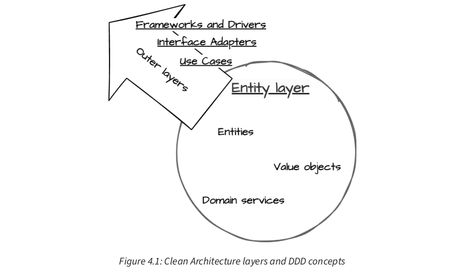
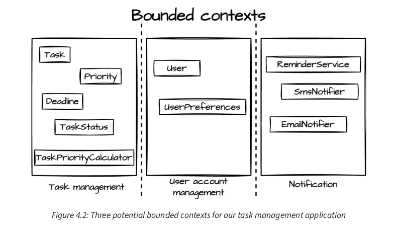
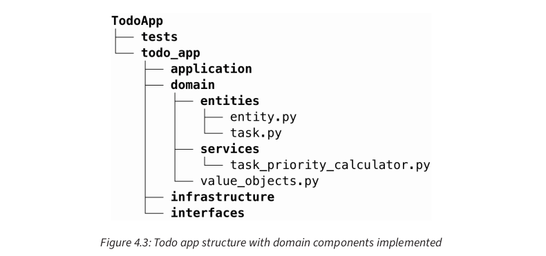

<div dir="rtl" style="text-align: right;">

### **۴. طراحی مبتنی بر دامنه: ساخت منطق اصلی کسب‌وکار**

**سرفصل‌های اصلی این فصل عبارتند از:**

* شناسایی و مدل‌سازی لایه دامنه با استفاده از اصول DDD
* پیاده‌سازی موجودیت‌ها در پایتون
* مفاهیم پیشرفته دامنه
* اطمینان از استقلال لایه دامنه

### **الزامات فنی**

### **شناسایی و مدل‌سازی لایه دامنه با استفاده از DDD**

**مزایای کلیدی ادغام DDD با معماری پاک عبارتند از:**

* **هم‌راستایی با نیازهای کسب‌وکار:** نرم‌افزار به بازتابی واقعی از دامنه کسب‌وکار تبدیل می‌شود، که ارزش آن را افزایش داده و تطبیق آن را با تحولات نیازهای کسب‌وکار آسان‌تر می‌کند.
* **بهبود ارتباطات:** DDD یک زبان مشترک بین توسعه‌دهندگان و متخصصان دامنه ایجاد می‌کند، که سوءتفاهم‌ها را کاهش داده و انسجام کلی پروژه را بهبود می‌بخشد.
* **انعطاف‌پذیری و قابلیت نگهداری پیشرفته:** یک مدل دامنه خوب طراحی شده به طور ذاتی انعطاف‌پذیرتر و نگهداری آن آسان‌تر است، زیرا بر مفاهیم اصلی کسب‌وکار بنا شده است نه بر محدودیت‌های فنی.
* **مقیاس‌پذیری طبیعی:** تمرکز DDD بر **زمینه‌های محدود (bounded contexts)** و رابط‌های واضح بین بخش‌های مختلف سیستم به طور طبیعی منجر به معماری‌های مقیاس‌پذیرتر می‌شود.

در سراسر این فصل، یک سیستم مدیریت وظایف شخصی به عنوان مثال جاری برای توضیح این مفاهیم مورد استفاده قرار می‌گیرد.

#### **درک DDD**

**DDD بر همکاری نزدیک بین کارشناسان فنی و دامنه تأکید دارد، با هدف:**

1. توسعه درک مشترک از دامنه.
2. ایجاد مدلی که پیچیدگی‌های دامنه را به دقت نشان می‌دهد.
3. پیاده‌سازی این مدل در کد، با حفظ یکپارچگی و گویایی آن.

#### **تحلیل نیازمندی‌های کسب‌وکار**

**نکته مهم:** در این مرحله از DDD،  **هیچ کدی نوشته نمی‌شود** . قدرت DDD در درک و مدل‌سازی کامل دامنه قبل از نوشتن حتی یک خط کد است.

#### **مفاهیم اصلی مدل‌سازی دامنه**

**در سیستم مدیریت وظایف، این زبان شامل اصطلاحاتی مانند:**

* **وظیفه (Task):** واحد کاری که باید تکمیل شود.
* **پروژه (Project):** مجموعه‌ای از وظایف مرتبط.
* **تاریخ سررسید (Due Date):** مهلت تکمیل وظیفه.
* **اولویت (Priority):** سطح اهمیت وظیفه (مثلاً پایین، متوسط، یا بالا).
* **وضعیت (Status):** وضعیت فعلی وظیفه (مثلاً برای انجام، در حال انجام، یا انجام شده).

با ایجاد این زبان مشترک، به بررسی مفاهیم ساختاری اساسی DDD که به پیاده‌سازی مدل دامنه کمک می‌کنند، می‌پردازیم.




: لایه‌های معماری پاک و مفاهیم DDD

**بررسی این مؤلفه‌ها:**

* **موجودیت‌ها (Entities):** اینها اشیایی هستند که با هویت خود تعریف می‌شوند و حتی زمانی که ویژگی‌هایشان تغییر می‌کند، هویتشان پابرجا می‌ماند. به عنوان مثال، یک سفارش (Order) همان سفارش باقی می‌ماند حتی اگر وضعیت آن از "در انتظار" به "ارسال شده" تغییر کند. در معماری پاک، این اشیاء اصلی کسب‌وکار، پایدارترین قوانین را در مرکز سیستم تجسم می‌دهند.
* **اشیاء ارزش (Value Objects):** اینها اشیاء غیرقابل تغییر (immutable) هستند که با ویژگی‌هایشان تعریف می‌شوند نه هویتشان. دو شیء پول (Money) با ارز و مقدار یکسان، برابر در نظر گرفته می‌شوند. آنها رفتارهای منسجمی را کپسوله می‌کنند بدون نیاز به شناسایی یکتا، که گویایی دامنه را افزایش داده و پیچیدگی را کاهش می‌دهد.
* **سرویس‌های دامنه (Domain Services):** اینها نمایانگر عملیات‌های بی‌حالت (stateless operations) هستند که به طور طبیعی به یک موجودیت یا شیء ارزش خاص تعلق ندارند. آنها منطق دامنه‌ای را که چندین شیء را شامل می‌شود، مدیریت می‌کنند، مانند محاسبه هزینه‌های حمل و نقل بر اساس اقلام سفارش و مکان مشتری.

این مؤلفه‌های مدل‌سازی، اساس لایه موجودیت ما در معماری پاک را تشکیل می‌دهند. در حالی که DDD واژگان و تکنیک‌ها را برای شناسایی و مدل‌سازی این مؤلفه‌ها بر اساس واقعیت‌های کسب‌وکار به ما می‌دهد، معماری پاک چارچوبی برای سازماندهی آنها در کدبیس ما فراهم می‌کند و تضمین می‌کند که آنها از نگرانی‌های خارجی مستقل باقی می‌مانند.

#### **مدل‌سازی دامنه مدیریت وظایف**

**موجودیت‌ها و اشیاء ارزش سیستم مدیریت وظایف:**
سیستم ما دارای دو موجودیت اصلی است:

* **وظیفه (Task):** موجودیت اصلی که یک واحد کار را نشان می‌دهد، با یک هویت پایدار با وجود تغییر ویژگی‌ها (مانند تغییر وضعیت).
* **کاربر (User):** یک کاربر سیستم را نشان می‌دهد که وظایف را مدیریت می‌کند، همچنین با یک هویت پایدار.

همچنین چندین شیء ارزش مهم داریم:

* **وضعیت وظیفه (Task status):** یک شمارش (enum) (مثلاً برای انجام، در حال انجام، یا انجام شده) که وضعیت یک وظیفه را نشان می‌دهد.
* **اولویت (Priority):** اهمیت وظیفه را نشان می‌دهد (مثلاً پایین، متوسط، یا بالا).
* **تاریخ سررسید (Deadline):** تاریخ و زمان سررسید را نشان می‌دهد، که رفتارهای مرتبطی مانند بررسی تأخیر را کپسوله می‌کند.

این اشیاء ارزش، گویایی مدل ما را افزایش می‌دهند.

**سرویس‌های دامنه سیستم مدیریت وظایف:**
عملیات‌های پیچیده‌ای که به یک موجودیت یا شیء ارزش خاص تعلق ندارند، به عنوان سرویس‌های دامنه پیاده‌سازی می‌شوند:

* **محاسبه‌گر اولویت وظیفه (Task priority calculator):** اولویت یک وظیفه را بر اساس عوامل مختلف محاسبه می‌کند.
* **سرویس یادآوری (Reminder service):** ایجاد و ارسال یادآوری‌های وظایف را مدیریت می‌کند.

این سرویس‌ها موجودیت‌ها و اشیاء ارزش ما را متمرکز و منسجم نگه می‌دارند.

#### **استفاده از زمینه‌های محدود (Bounded Contexts)**

**سه زمینه محدود متمایز در سیستم ما:**

* **مدیریت وظایف (Task management):** زمینه اصلی، که عملیات‌های مرتبط با وظایف را مدیریت می‌کند.
* **مدیریت حساب کاربری (User account management):** عملیات‌های مرتبط با کاربر را مدیریت می‌کند.
* **اعلان (Notification):** ایجاد و ارسال اعلان‌ها به کاربران را مدیریت می‌کند.

این زمینه‌ها مرزهای واضحی را در سیستم ما ایجاد می‌کنند، که امکان توسعه مستقل را فراهم می‌آورند و در عین حال تعاملات لازم را ممکن می‌سازند.



: سه زمینه محدود احتمالی برای برنامه مدیریت وظایف ما

### **پیاده‌سازی موجودیت‌ها در پایتون**

#### **مقدمه‌ای بر موجودیت‌های پایتون**

**ملاحظات پیاده‌سازی کلیدی:**

* **هویت (Identity):** پیاده‌سازی شناسه‌های یکتا با استفاده از سیستم شناسه یکتا جهانی پایتون (UUID).
* **تغییرپذیری (Mutability):** استفاده از ویژگی‌های شیءگرا پایتون برای مدیریت تغییرات وضعیت.
* **چرخه حیات (Life cycle):** مدیریت ایجاد، اصلاح و حذف اشیاء از طریق متدهای کلاس پایتون.
* **قوانین کسب‌وکار (Business rules):** استفاده از سیستم تایپ پایتون و متدهای کلاس برای اعمال قوانین کسب‌وکار.

**معرفی کلاس‌های داده (Data Classes) در پایتون:**
در پیاده‌سازی، از کلاس‌های داده پایتون استفاده می‌شود که در پایتون 3.7 معرفی شدند. کلاس‌های داده روشی مختصر برای ایجاد کلاس‌هایی هستند که عمدتاً داده‌ها را ذخیره می‌کنند اما می‌توانند رفتار نیز داشته باشند. آنها به طور خودکار چندین متد خاص مانند `__init__()`، `__repr__()` و `__eq__()` را تولید می‌کنند و کد boilerplate را کاهش می‌دهند.

**مزایای کلیدی کلاس‌های داده:**

* **کاهش کد boilerplate:** به طور خودکار متدهای رایج را تولید می‌کند.
* **وضوح:** ساختار داده را به وضوح بیان می‌کند.
* **گزینه تغییرناپذیری:** می‌تواند اشیاء غیرقابل تغییر ایجاد کند، که با اصول DDD برای اشیاء ارزش هم‌راستا است.
* **مقادیر پیش‌فرض:** به راحتی مقادیر پیش‌فرض را برای ویژگی‌ها مشخص می‌کند.

کلاس‌های داده با اصول معماری پاک هم‌راستا هستند زیرا موجودیت‌های واضح و متمرکزی را ترویج می‌دهند که داده‌ها و رفتار را کپسوله می‌کنند. آنها به ایجاد موجودیت‌هایی کمک می‌کنند که درک، نگهداری و آزمایش آنها آسان است.

**اطمینان از برابری مناسب کلاس در پایتون:**
همانطور که در کلاس پایه موجودیت دیدیم، متدهای `__eq__` و `__hash__` برای اطمینان از بررسی هویت و برابری مناسب پیاده‌سازی شده‌اند. این برای موجودیت‌ها حیاتی است، زیرا دو وظیفه با ویژگی‌های یکسان اما شناسه‌های متفاوت باید موجودیت‌های متفاوتی در نظر گرفته شوند.

مثال کد: کلاس پایه `Entity`

</div>

```python
from dataclasses import dataclass, field
from uuid import UUID, uuid4

@dataclass
class Entity:
    # Automatically generates a unique UUID for the 'id' field;
    # excluded from the __init__ method
    id: UUID = field(default_factory=uuid4, init=False)

    def __eq__(self, other: object) -> bool:
        if not isinstance(other, type(self)):
            return NotImplemented
        return self.id == other.id

    def __hash__(self) -> int:
        return hash(self.id)
```
<div dir="rtl" style="text-align: right;">

#### **ایجاد موجودیت‌های دامنه**

**پیاده‌سازی موجودیت Task:**
مثال کد: ساختار اولیه موجودیت `Task`


</div>

```python
from dataclasses import dataclass, field
from typing import Optional

@dataclass
class Task(Entity):
    title: str
    description: str
    due_date: Optional['Deadline'] = None # 'Deadline' will be defined later
    priority: 'Priority' = field(default=None, init=False) # 'Priority' will be defined later
    status: 'TaskStatus' = field(default=None, init=False) # 'TaskStatus' will be defined later

    def __post_init__(self):
        # Set default values for priority and status if they are not explicitly set
        if self.priority is None:
            self.priority = Priority.MEDIUM
        if self.status is None:
            self.status = TaskStatus.TODO

```
<div dir="rtl" style="text-align: right;">

**بررسی ویژگی‌ها:**

* `title`: یک رشته که نام یا توضیح مختصری از وظیفه را نشان می‌دهد.
* `description`: توضیحی دقیق‌تر از آنچه وظیفه شامل می‌شود.
* `due_date`: یک شیء `Deadline` اختیاری که نشان می‌دهد وظیفه چه زمانی باید تکمیل شود.
* `priority`: اهمیت وظیفه را نشان می‌دهد، که به طور پیش‌فرض روی `MEDIUM` تنظیم شده است.
* `status`: وضعیت فعلی وظیفه را نشان می‌دهد، که به طور پیش‌فرض روی `TODO` تنظیم شده است.

مثال کد: اشیاء ارزش `TaskStatus`, `Priority`, و `Deadline`


</div>

```python
from enum import Enum
from dataclasses import dataclass
from datetime import datetime, timedelta, timezone
import uuid # Assuming UUID will be used for product_id later in the book.

# For Task entity, we need to import Entity and UUID
from todo_app.domain.entities.entity import Entity
from uuid import UUID, uuid4

class TaskStatus(Enum):
    TODO = "TODO"
    IN_PROGRESS = "IN_PROGRESS"
    DONE = "DONE"

class Priority(Enum):
    LOW = 1
    MEDIUM = 2
    HIGH = 3

# frozen=True makes this immutable as it should be for a Value Object
@dataclass(frozen=True)
class Deadline:
    due_date: datetime

    def __post_init__(self):
        # We need to ensure datetime objects are timezone-aware for comparison.
        # If due_date is naive, make it timezone-aware (e.g., UTC)
        if self.due_date.tzinfo is None:
            object.__setattr__(self, 'due_date', self.due_date.replace(tzinfo=timezone.utc))

        if self.due_date < datetime.now(timezone.utc):
            raise ValueError("Deadline cannot be in the past")

    def is_overdue(self) -> bool:
        return datetime.now(timezone.utc) > self.due_date

    def time_remaining(self) -> timedelta:
        return max(
            timedelta(0),
            self.due_date - datetime.now(timezone.utc)
        )

    def is_approaching(
        self, warning_threshold: timedelta = timedelta(days=1)
    ) -> bool:
        time_left = self.time_remaining()
        return timedelta(0) < time_left <= warning_threshold

# Corrected Task entity with imports based on the full code in the repo
@dataclass
class Task(Entity):
    title: str
    description: str
    project_id: UUID # Added based on later sections/full repo code, assuming tasks belong to projects
    due_date: Optional[Deadline] = None
    priority: Priority = Priority.MEDIUM
    status: TaskStatus = field(default=TaskStatus.TODO, init=False)
    completed_at: Optional[datetime] = None # Added for completion logic later in the chapter

    def complete(self, notes: Optional[str] = None) -> None: # Added notes param for consistency with later chapters
        if self.status == TaskStatus.DONE:
            raise ValueError("Task is already completed")
        self.status = TaskStatus.DONE
        self.completed_at = datetime.now(timezone.utc)
        # notes handling can be added if needed, not shown in source's Task entity itself

    def start(self) -> None:
        if self.status != TaskStatus.TODO:
            raise ValueError("Only tasks with 'TODO' status can be started")
        self.status = TaskStatus.IN_PROGRESS

    def is_overdue(self) -> bool:
        return self.due_date is not None and self.due_date.is_overdue()
```
<div dir="rtl" style="text-align: right;">

**مثال‌هایی از کاربرد موجودیت `Task` با این اشیاء ارزش:**


</div>

```python

from datetime import datetime, timedelta, timezone
from uuid import UUID # Added for UUID usage

# Assuming Task, Deadline, Priority and TaskStatus are defined as above

# Create a new task
# A project_id is needed based on later content in the chapter/full repo code
sample_project_id = UUID('a1b2c3d4-e5f6-7890-1234-567890abcdef')
task = Task(
    title="Complete project proposal",
    description="Draft and review the proposal for the new client project",
    project_id=sample_project_id,
    priority=Priority.HIGH
)

# Check task properties
print(f"Title: {task.title}")     # Output: Title: Complete project proposal
print(f"Priority: {task.priority}")  # Output: Priority: Priority.HIGH
print(f"Status: {task.status}")    # Output: Status: TaskStatus.TODO
```
<div dir="rtl" style="text-align: right;">

#### **کپسوله‌سازی قوانین کسب‌وکار در موجودیت‌ها**

**اضافه کردن قوانین کسب‌وکار به موجودیت `Task`:**
مثال کد: افزودن متدهای `start` و `complete` به `Task`


</div>

```python
# Assuming Task, TaskStatus, Deadline, Priority and Entity are defined as before,
# and UUID is imported.

from datetime import datetime, timedelta, timezone
from dataclasses import dataclass, field
from typing import Optional
from uuid import UUID

from todo_app.domain.entities.entity import Entity # Ensure Entity is imported
from enum import Enum # Ensure Enum is imported if not already

class TaskStatus(Enum):
    TODO = "TODO"
    IN_PROGRESS = "IN_PROGRESS"
    DONE = "DONE"

class Priority(Enum):
    LOW = 1
    MEDIUM = 2
    HIGH = 3

@dataclass(frozen=True)
class Deadline:
    due_date: datetime

    def __post_init__(self):
        if self.due_date.tzinfo is None:
            object.__setattr__(self, 'due_date', self.due_date.replace(tzinfo=timezone.utc))
        if self.due_date < datetime.now(timezone.utc):
            raise ValueError("Deadline cannot be in the past")

    def is_overdue(self) -> bool:
        return datetime.now(timezone.utc) > self.due_date

    def time_remaining(self) -> timedelta:
        return max(timedelta(0), self.due_date - datetime.now(timezone.utc))

    def is_approaching(self, warning_threshold: timedelta = timedelta(days=1)) -> bool:
        time_left = self.time_remaining()
        return timedelta(0) < time_left <= warning_threshold


@dataclass
class Task(Entity):
    title: str
    description: str
    project_id: UUID # Added for consistency with full repo code and later chapter content
    due_date: Optional[Deadline] = None
    priority: Priority = Priority.MEDIUM
    status: TaskStatus = field(default=TaskStatus.TODO, init=False)
    completed_at: Optional[datetime] = None
    completed_by: Optional[UUID] = None # Added for consistency with full repo code and later chapter content


    def start(self) -> None:
        if self.status != TaskStatus.TODO:
            raise ValueError(
                "Only tasks with 'TODO' status can be started")
        self.status = TaskStatus.IN_PROGRESS

    def complete(self, notes: Optional[str] = None, completed_by_id: Optional[UUID] = None) -> None:
        if self.status == TaskStatus.DONE:
            raise ValueError("Task is already completed")
        self.status = TaskStatus.DONE
        self.completed_at = datetime.now(timezone.utc)
        self.completed_by = completed_by_id # Set who completed it

    def is_overdue(self) -> bool:
        return self.due_date is not None and self.due_date.is_overdue()

```
<div dir="rtl" style="text-align: right;">

#### **تمایز قوانین سطح موجودیت از قوانین سطح دامنه**

با این ساختار موجودیت‌ها، جدایی واضحی بین قوانین خاص موجودیت و قوانین گسترده‌تر دامنه حفظ می‌شود و به اصول معماری پاک پایبندی و موجودیت‌ها متمرکز و قابل نگهداری باقی می‌مانند.

#### **اشیاء ارزش (Value Objects) در معماری پاک**

**مزایای خاص پیاده‌سازی اشیاء ارزش در معماری پاک:**

* **تغییرناپذیری (Immutability):** پس از ایجاد، وضعیت آنها قابل تغییر نیست. این به جلوگیری از باگ‌ها کمک می‌کند و کد را آسان‌تر قابل فهم می‌سازد.
* **برابری بر اساس ویژگی‌ها (Equality based on attributes):** دو شیء ارزش با ویژگی‌های یکسان، برابر در نظر گرفته می‌شوند، برخلاف موجودیت‌ها که دارای هویت یکتا هستند.
* **کپسوله‌سازی مفاهیم دامنه (Encapsulation of domain concepts):** آنها ایده‌های دامنه را به عنوان عناصر درجه اول در کد ما نشان می‌دهند و گویایی را بهبود می‌بخشند.
* **پیشگیری از وسواس اولیه (Prevention of primitive obsession):** آنها استفاده از انواع اولیه را برای نمایش مفاهیم دامنه جایگزین می‌کنند، که معنای معنایی و ایمنی نوع را اضافه می‌کند.
* **تست‌پذیری ساده (Simplified testing):** اشیاء ارزش آسان برای ایجاد و استفاده در تست‌ها هستند، که تست‌پذیری سیستم را بهبود می‌بخشد.

مثال کد: تفاوت استفاده از رشته در مقابل `TaskStatus` enum


</div>

```python

# Assuming Task, TaskStatus are defined as above

# Using string (problematic)
sample_project_id = UUID('a1b2c3d4-e5f6-7890-1234-567890abcdef')
task_str = Task(
    title="Complete project",
    description="The important project",
    project_id=sample_project_id
)
# Manually set status attribute, bypassing any logic if it were in __init__
object.__setattr__(task_str, 'status', "Finished") # This is how you'd set a frozen field
print(f"Status set as string: {task_str.status}") # Output: Status set as string: Finished
print(f"Is status 'done' (case-sensitive)? {task_str.status == 'done'}")  # Output: Is status 'done' (case-sensitive)? False

# Using TaskStatus enum (robust)
task_enum = Task(
    title="Complete project",
    description="The important project",
    project_id=sample_project_id
)
task_enum.status = TaskStatus.DONE  # Type-safe, and if type checkers are used, would warn if invalid enum value
print(f"Status set as enum: {task_enum.status}") # Output: Status set as enum: TaskStatus.DONE
print(f"Is status TaskStatus.DONE? {task_enum.status == TaskStatus.DONE}")  # Output: Is status TaskStatus.DONE? True
```
<div dir="rtl" style="text-align: right;">

#### **پیاده‌سازی سرویس‌های دامنه**

**پیاده‌سازی یک سرویس `TaskPriorityCalculator` ساده:**
مثال کد: کلاس `TaskPriorityCalculator`


</div>

```python
from datetime import datetime, timedelta, timezone # Ensure these are imported
from todo_app.domain.entities.task import Task, Priority, Deadline, TaskStatus # Ensure Task and its enums/Deadline are imported
from uuid import UUID # Ensure UUID is imported if Task uses it

class TaskPriorityCalculator:
    @staticmethod
    def calculate_priority(task: Task) -> Priority:
        if task.is_overdue():
            return Priority.HIGH
        elif (
            task.due_date and task.due_date.time_remaining() <=
            timedelta(days=2)
        ):
            return Priority.MEDIUM
        else:
            return Priority.LOW

```
<div dir="rtl" style="text-align: right;">

با پیاده‌سازی مدل دامنه به این روش، مجموعه‌ای غنی و گویایی از کلاس‌های پایتون ایجاد می‌شود که دامنه مدیریت وظایف را به دقت نشان می‌دهد. این کلاس‌ها قوانین اصلی کسب‌وکار را کپسوله می‌کنند و اطمینان حاصل می‌کنند که منطق اصلی دامنه ما منسجم و سازمان‌یافته باقی می‌ماند.



اختار برنامه Todo با مؤلفه‌های دامنه پیاده‌سازی شده

### **بهبود مدل دامنه با Aggregates و Factories**

#### **الگوهای DDD**

#### **Aggregates (مجموعه‌ها)**

در سیستم مدیریت وظایف، یک aggregate طبیعی می‌تواند یک پروژه (project) باشد که شامل چندین وظیفه (task) است.

مثال کد: پیاده‌سازی کلاس `Project` به عنوان Aggregate Root


</div>

```python

# Assuming Entity, Task, UUID are imported from their respective modules
# todo_app/domain/entities/project.py

from dataclasses import dataclass, field
from typing import Optional, List, Dict
from uuid import UUID, uuid4

from todo_app.domain.entities.entity import Entity # Assuming Entity is in this path
from todo_app.domain.entities.task import Task # Assuming Task is in this path
from todo_app.domain.entities.task import TaskStatus, Priority # Also need these enums if Project refers to Task status/priority in logic

class ProjectType(Enum): # Added for consistency with later chapter's refinement
    REGULAR = "REGULAR"
    INBOX = "INBOX"

@dataclass
class Project(Entity):
    name: str
    description: str = ""
    _tasks: Dict[UUID, Task] = field(default_factory=dict, init=False, repr=False) # repr=False to avoid recursive repr
    project_type: ProjectType = field(default=ProjectType.REGULAR) # Added for consistency with later chapter's refinement

    def add_task(self, task: Task) -> None:
        if not isinstance(task, Task):
            raise TypeError("Only Task objects can be added to a Project.")
        if task.project_id != self.id: # Ensure task's project_id matches this project
            raise ValueError(f"Task {task.id} does not belong to project {self.id}")
        self._tasks[task.id] = task

    def remove_task(self, task_id: UUID) -> None:
        self._tasks.pop(task_id, None)

    def get_task(self, task_id: UUID) -> Optional[Task]:
        return self._tasks.get(task_id)

    @property
    def tasks(self) -> List[Task]:
        return list(self._tasks.values())

    @property
    def incomplete_tasks(self) -> List[Task]: # Added for consistency with later chapter's use cases
        return [task for task in self.tasks if task.status != TaskStatus.DONE]

    @property
    def is_completed(self) -> bool: # Added for consistency with later chapter's use cases
        return all(task.status == TaskStatus.DONE for task in self.tasks) and len(self.tasks) > 0 # Project is done if all tasks are done and it's not empty

    def mark_completed(self, notes: Optional[str] = None) -> None: # Added for consistency with later chapter's use cases
        if not self.is_completed:
            raise ValueError("Cannot complete project: not all tasks are done.")
        # Additional logic for project completion can go here, e.g., setting a completed_at timestamp
        # For simplicity, we just assume setting is_completed as True is enough based on tasks.
        pass # The actual status might be managed externally or be a derived property

    @classmethod
    def create_inbox(cls) -> "Project": # Added for consistency with later chapter's refinement
        return cls(
            name="INBOX",
            description="Default project for unassigned tasks",
            project_type=ProjectType.INBOX,
            id=UUID("00000000-0000-0000-0000-000000000000") # A predefined UUID for INBOX for simplicity in repo
        )

```
<div dir="rtl" style="text-align: right;">

**مثال کد: کاربرد `Project`**


</div>

```python


from datetime import datetime, timezone
# Ensure Task, Deadline, Priority, TaskStatus, Project are imported from their modules
from todo_app.domain.entities.task import Task, Priority, Deadline, TaskStatus
from todo_app.domain.entities.project import Project
from uuid import UUID

# Assume a static UUID for initial project creation for demonstration
project_uuid_str = "12345678-abcd-efab-cdef-123456789012"
project_uuid = UUID(project_uuid_str)

# Project usage
project = Project(name="Website Redesign", description="Redesign the company website", id=project_uuid) # Pass id during creation

task1 = Task(
    title="Design homepage",
    description="Create new homepage layout",
    project_id=project.id, # Assign task to the project's UUID
    due_date=Deadline(datetime(2023, 12, 31, 23, 59, 59, tzinfo=timezone.utc)), # Make datetime timezone-aware
    priority=Priority.HIGH,
)
task2 = Task(
    title="Implement login",
    description="Add user authentication",
    project_id=project.id, # Assign task to the project's UUID
    due_date=Deadline(datetime(2023, 11, 30, 23, 59, 59, tzinfo=timezone.utc)), # Make datetime timezone-aware
    priority=Priority.MEDIUM,
)
project.add_task(task1)
project.add_task(task2)

print(f"Project: {project.name}") # Output: Project: Website Redesign
print(f"Number of tasks: {len(project.tasks)}") # Output: Number of tasks: 2
print(f"First task: {project.tasks.title}") # Output: First task: Design homepage
```

<div dir="rtl" style="text-align: right;">


#### **الگوی Factory (کارخانه)**

**کلاس‌های داده و ایجاد شیء:**
موجودیت `Task` ما، که به عنوان یک dataclass پیاده‌سازی شده است، خود یک روش تمیز و کارآمد برای ایجاد اشیاء فراهم می‌کند. تعریف این dataclass به طور خودکار متد `__init__` را تولید می‌کند، که بسیاری از کارهایی را که یک Factory سنتی انجام می‌دهد، مدیریت می‌کند. این شامل تنظیم مقادیر پیش‌فرض، مدیریت پارامترهای اختیاری و تضمین انسجام نوع (هنگام استفاده از Type Checkerها) است.

مثال کد: کلاس `Task` با `__post_init__`


</div>

```python


from dataclasses import dataclass, field
from typing import Optional, List
from uuid import UUID, uuid4
from datetime import datetime, timedelta, timezone

from todo_app.domain.entities.entity import Entity
from todo_app.domain.entities.task import Priority, TaskStatus, Deadline

@dataclass
class Task(Entity):
    title: str
    description: str
    project_id: UUID
    due_date: Optional[Deadline] = None
    priority: Priority = Priority.MEDIUM
    status: TaskStatus = field(default=TaskStatus.TODO, init=False)
    completed_at: Optional[datetime] = None
    completed_by: Optional[UUID] = None

    def __post_init__(self):
        # Ensure that mandatory fields are not empty strings
        if not self.title.strip():
            raise ValueError("Task title cannot be empty")
        # Example of another validation rule
        if len(self.description) > 500:
            raise ValueError(
                "Task description cannot exceed 500 characters")

    # Example of class method as an alternative constructor
    @classmethod
    def create_urgent_task(
        cls, title: str, description: str, project_id: UUID, due_date: Deadline
    ) -> 'Task':
        return cls(title, description, project_id, due_date, Priority.HIGH)

    # Rest of the Task methods like start(), complete(), is_overdue() would be here
    def start(self) -> None:
        if self.status != TaskStatus.TODO:
            raise ValueError(
                "Only tasks with 'TODO' status can be started")
        self.status = TaskStatus.IN_PROGRESS

    def complete(self, notes: Optional[str] = None, completed_by_id: Optional[UUID] = None) -> None:
        if self.status == TaskStatus.DONE:
            raise ValueError("Task is already completed")
        self.status = TaskStatus.DONE
        self.completed_at = datetime.now(timezone.utc)
        self.completed_by = completed_by_id

    def is_overdue(self) -> bool:
        return self.due_date is not None and self.due_date.is_overdue()

```
<div dir="rtl" style="text-align: right;">

**مثال کد: کلاس `TaskFactory`**


</div>

```python


from typing import Dict, Any, List # Added for type hinting consistency
from uuid import UUID
from todo_app.domain.entities.task import Task, Priority # Assuming Task and Priority are defined
from todo_app.domain.entities.project import Project # Assuming Project is defined
from todo_app.domain.repositories.project_repository import ProjectRepository # Assuming this interface exists
from todo_app.domain.services.user_service import UserService # Assuming this interface exists

# Define placeholder interfaces/classes for demonstration if they don't exist in Task or Project modules
class UserService:
    def get_user(self, user_id: UUID) -> Any: # Returns user object or dict
        # Placeholder for actual user retrieval logic
        print(f"Fetching user {user_id}...")
        # Simulate a user object with a method
        class MockUser:
            def __init__(self, is_manager: bool):
                self._is_manager = is_manager
            def is_manager(self):
                return self._is_manager
        return MockUser(is_manager=True) if user_id == UUID('12345678-1234-5678-1234-567812345678') else MockUser(is_manager=False)

class ProjectRepository:
    def get_by_id(self, project_id: UUID) -> Optional[Project]:
        # Placeholder for actual project retrieval logic
        print(f"Fetching project {project_id}...")
        class MockProject:
            def __init__(self, is_high_priority: bool, project_id: UUID):
                self._is_high_priority = is_high_priority
                self.id = project_id
                self._tasks = {}
            def is_high_priority(self):
                return self._is_high_priority
            def add_task(self, task: Task):
                self._tasks[task.id] = task
        # Simulate a high-priority project
        if project_id == UUID('a1b2c3d4-e5f6-7890-1234-567890abcdef'):
            return MockProject(is_high_priority=True, project_id=project_id)
        return MockProject(is_high_priority=False, project_id=project_id)


class TaskFactory:
    def __init__(self, user_service: UserService, project_repository: ProjectRepository):
        self.user_service = user_service
        self.project_repository = project_repository

    def create_task_in_project(self, title: str, description: str,
                               project_id: UUID, assignee_id: UUID) -> Task:
        project = self.project_repository.get_by_id(project_id)
        if not project:
            raise ValueError(f"Project with ID {project_id} not found.")

        assignee = self.user_service.get_user(assignee_id)
        if not assignee:
            raise ValueError(f"Assignee with ID {assignee_id} not found.")

        # Instantiate Task with a dummy project_id for now, as it's modified later
        # Assuming Task requires project_id in its constructor as per updated entity
        task = Task(title=title, description=description, project_id=project.id)

        # The Task entity does not have 'project' or 'assignee' attributes directly.
        # These are usually handled through relationships in repositories or use cases.
        # For demonstration of business logic based on external objects:
        if project.is_high_priority() and assignee.is_manager():
            task.priority = Priority.HIGH # This directly modifies the task's priority

        project.add_task(task) # Add the task to the project's internal collection
        return task

# Example Usage:
# Assuming project_repo and user_service instances are available
# (These would typically be injected or created by a composition root)

# Dummy instances for demonstration
mock_user_service = UserService()
mock_project_repo = ProjectRepository()

task_factory = TaskFactory(mock_user_service, mock_project_repo)

# Example project and user IDs
example_project_id = UUID('a1b2c3d4-e5f6-7890-1234-567890abcdef')
manager_user_id = UUID('12345678-1234-5678-1234-567812345678')
regular_user_id = UUID('98765432-fedc-ba98-7654-3210fedcba98')

# Create a task in a high-priority project by a manager
try:
    task_high_priority = task_factory.create_task_in_project(
        "Urgent Feature", "Implement critical feature X",
        example_project_id, manager_user_id
    )
    print(f"Task 'Urgent Feature' priority: {task_high_priority.priority}") # Expected: HIGH
except ValueError as e:
    print(e)

# Create a task in the same high-priority project by a regular user
try:
    task_medium_priority = task_factory.create_task_in_project(
        "Regular Bug Fix", "Fix minor bug Y",
        example_project_id, regular_user_id
    )
    print(f"Task 'Regular Bug Fix' priority: {task_medium_priority.priority}") # Expected: MEDIUM
except ValueError as e:
    print(e)

```
<div dir="rtl" style="text-align: right;">

### **اطمینان از استقلال دامنه**

#### **قانون وابستگی در عمل**

**مثال ۱: موجودیت `Task` با وابستگی پایگاه داده**


</div>

```python

from dataclasses import dataclass, field
from typing import Optional
from uuid import UUID, uuid4 # Assuming UUID is used for Task ID

# Placeholder for a database connection class - this would be in an outer layer
class DbConnection:
    def update(self, entity_data: dict):
        print(f"Updating entity in DB: {entity_data}")

@dataclass
class TaskWithDatabase:
    title: str
    description: str
    db: DbConnection  # This violates the Dependency Rule
    # Assuming other necessary fields like project_id are handled elsewhere or added for consistency
    due_date: Optional[object] = None # Using object as placeholder for Deadline, to avoid import
    priority: Optional[object] = None # Placeholder for Priority
    status: Optional[object] = field(default=None, init=False) # Placeholder for TaskStatus

    def __post_init__(self):
        # Set default values similar to Task entity
        if self.status is None:
            self.status = "TODO_STATUS" # Placeholder string for TaskStatus.TODO

    def mark_as_complete(self):
        self.status = "DONE_STATUS" # Placeholder string for TaskStatus.DONE
        self.db.update({"id": str(self.id) if hasattr(self, 'id') else 'unknown_id', "status": self.status, "title": self.title}) # This violates the Dependency Rule
        # In a real scenario, this would likely be an attribute on TaskWithDatabase
        # For demonstration, assign a dummy ID if not present
        if not hasattr(self, 'id'):
            object.__setattr__(self, 'id', uuid4())


# Example Usage (demonstrates the coupling)
# db_conn = DbConnection()
# task_coupled = TaskWithDatabase(title="Draft Report", description="Write quarterly report", db=db_conn)
# print(f"Initial status: {task_coupled.status}")
# task_coupled.mark_as_complete()
# print(f"New status: {task_coupled.status}")
```
<div dir="rtl" style="text-align: right;">

**مثال ۲: Aggregate `Project` با وابستگی UI**


</div>

```python


from dataclasses import dataclass, field
from typing import Dict, Optional, List
from uuid import UUID, uuid4

from todo_app.domain.entities.entity import Entity # Assuming Entity is defined

# Placeholder for a UI component - this would be in an outer layer
class UiComponent:
    def refresh(self):
        print("UI is refreshing...")

@dataclass
class ProjectWithUI(Entity):
    name: str
    ui: UiComponent  # Violates the Dependency Rule
    description: str = ""
    _tasks: Dict[UUID, object] = field(default_factory=dict, init=False) # Using object as placeholder for Task

    def add_task(self, task: object) -> None: # Using object as placeholder for Task
        # Assuming task has an 'id' attribute
        if hasattr(task, 'id'):
            self._tasks[task.id] = task
        else:
            self._tasks[uuid4()] = task # Assign dummy ID if no ID
        self.ui.refresh()  # Violates the Dependency Rule

# Example Usage
# ui_comp = UiComponent()
# project_coupled = ProjectWithUI(name="New Feature", ui=ui_comp)
# print(f"Project created: {project_coupled.name}")
# project_coupled.add_task(type('Task', (object,), {'id': uuid4(), 'title': 'Sub-task 1'})) # Dummy task
```
<div dir="rtl" style="text-align: right;">

این مثال‌ها نه تنها قانون وابستگی را نقض می‌کنند، بلکه اصل مسئولیت واحد (SRP) از SOLID را نیز نقض می‌کنند. کلاس `TaskWithDatabase` هم مسئول مدیریت وظیفه و هم عملیات پایگاه داده است، در حالی که `ProjectWithUI` هم مدیریت پروژه و هم به‌روزرسانی‌های UI را انجام می‌دهد. این نقض‌ها استقلال و تمرکز لایه دامنه ما را به خطر می‌اندازند و آن را انعطاف‌ناپذیرتر، سخت‌تر برای آزمایش، و چالش‌برانگیزتر برای نگهداری می‌سازند.

با حذف این وابستگی‌های خارجی و پایبندی به SRP، موجودیت‌های دامنه خالصی ایجاد می‌کنیم که تنها بر مفاهیم و قوانین اصلی کسب‌وکار تمرکز دارند. این رویکرد تضمین می‌کند که لایه دامنه ما هسته پایدار برنامه ما باقی می‌ماند، بدون تأثیر تغییرات در سیستم‌های خارجی، پایگاه‌های داده یا رابط‌های کاربری.

#### **اجتناب از وابستگی‌های خارجی**

**مثال کد: تعریف `TaskRepository` انتزاعی در لایه دامنه**


</div>

```python


# In the Domain layer :
# (e.g., todo_app/domain/repositories/task_repository.py)

from abc import ABC, abstractmethod
from uuid import UUID # Required for task_id type hint
from todo_app.domain.entities.task import Task # Assuming Task is defined here

class TaskRepository(ABC):
    """Repository interface defined by the Application Layer"""
    @abstractmethod
    def save(self, task: Task) -> None:
        """Save a task to the repository"""
        pass

    @abstractmethod
    def get(self, task_id: UUID) -> Task: # Changed str to UUID for consistency with Task entity id type
        """Retrieve a task by its ID"""
        pass

    # Added for consistency with later chapter's examples/full repo
    @abstractmethod
    def delete(self, task_id: UUID) -> None:
        """Delete a task from the repository"""
        pass

    @abstractmethod
    def get_all(self) -> List[Task]:
        """Retrieve all tasks"""
        pass

```
<div dir="rtl" style="text-align: right;">

**مثال کد: استفاده از این مخزن در یک سرویس دامنه (`TaskService`)**


</div>

```python


# In the Domain layer (e.g., todo_app/domain/services/task_service.py)

from todo_app.domain.entities.task import Task, TaskStatus, Priority, Deadline # Ensure Task and its related types are imported
from todo_app.domain.repositories.task_repository import TaskRepository # Ensure TaskRepository is imported
from uuid import UUID
from datetime import datetime, timezone

# Define a placeholder for TaskNotFoundError if it's not defined elsewhere in domain.entities
class TaskNotFoundError(Exception):
    def __init__(self, task_id: UUID):
        self.task_id = task_id
        super().__init__(f"Task with ID {task_id} not found.")


class TaskService:
    def __init__(self, task_repository: TaskRepository):
        self.task_repository = task_repository

    def create_task(self, title: str, description: str, project_id: UUID,
                    due_date: Optional[Deadline] = None, priority: Priority = Priority.MEDIUM) -> Task:
        task = Task(title=title, description=description, project_id=project_id,
                    due_date=due_date, priority=priority) # Pass all required args
        self.task_repository.save(task)
        return task

    def mark_task_as_complete(self, task_id: UUID) -> Task:
        task = self.task_repository.get(task_id)
        if not task: # Handle case where task is not found by get method (if it returns Optional)
            raise TaskNotFoundError(task_id)
        task.complete()
        self.task_repository.save(task)
        return task

```
<div dir="rtl" style="text-align: right;">

**پیاده‌سازی واقعی `TaskRepository` در یک لایه خارجی‌تر (لایه زیرساخت):**
مثال کد: پیاده‌سازی `SQLiteTaskRepository`


</div>

```python


# In an outer layer
# .../infrastructure/persistence/sqlite_task_repository.py

from todo_app.domain.entities.task import Task # Ensure Task is imported
from todo_app.domain.repositories.task_repository import TaskRepository # Ensure interface is imported
from todo_app.domain.entities.project import Project # Need Project to handle task's project_id
from todo_app.domain.entities.entity import Entity
from todo_app.domain.entities.task import TaskStatus, Priority, Deadline
from typing import List, Optional
from uuid import UUID
from datetime import datetime, timezone
import sqlite3 # Actual database driver

# Define a concrete error for persistence layer if not already defined
class PersistenceError(Exception):
    pass

# Assuming TaskNotFoundError is defined in domain.repositories.task_repository
class TaskNotFoundError(Exception):
    def __init__(self, task_id: UUID):
        self.task_id = task_id
        super().__init__(f"Task with ID {task_id} not found.")

class SQLiteTaskRepository(TaskRepository):
    def __init__(self, db_connection_string: str):
        self.db_connection_string = db_connection_string
        self._init_db()

    def _init_db(self):
        conn = None
        try:
            conn = sqlite3.connect(self.db_connection_string)
            cursor = conn.cursor()
            cursor.execute('''
                CREATE TABLE IF NOT EXISTS tasks (
                    id TEXT PRIMARY KEY,
                    title TEXT NOT NULL,
                    description TEXT,
                    project_id TEXT NOT NULL,
                    due_date TEXT,
                    priority INTEGER,
                    status TEXT,
                    completed_at TEXT,
                    completed_by TEXT
                )
            ''')
            conn.commit()
        except sqlite3.Error as e:
            print(f"Database initialization error: {e}")
            raise PersistenceError(f"Database initialization failed: {e}")
        finally:
            if conn:
                conn.close()

    def _dict_to_task(self, data: dict) -> Task:
        due_date = None
        if data.get('due_date'):
            try:
                # Assuming due_date is stored as ISO format string
                dt_obj = datetime.fromisoformat(data['due_date']).replace(tzinfo=timezone.utc)
                due_date = Deadline(dt_obj)
            except ValueError:
                pass # Or log error

        priority = Priority(data.get('priority', Priority.MEDIUM.value))
        status = TaskStatus(data.get('status', TaskStatus.TODO.value))

        completed_at = None
        if data.get('completed_at'):
            try:
                completed_at = datetime.fromisoformat(data['completed_at']).replace(tzinfo=timezone.utc)
            except ValueError:
                pass

        completed_by = UUID(data['completed_by']) if data.get('completed_by') else None

        # Instantiate Task directly since its constructor takes these arguments
        task = Task(
            title=data['title'],
            description=data['description'],
            project_id=UUID(data['project_id']),
            id=UUID(data['id']),
            due_date=due_date,
            priority=priority,
        )
        # Manually set status and completed_at if not init'd (due to init=False in Task's field)
        object.__setattr__(task, 'status', status)
        object.__setattr__(task, 'completed_at', completed_at)
        object.__setattr__(task, 'completed_by', completed_by)
        return task

    def _task_to_dict(self, task: Task) -> dict:
        return {
            'id': str(task.id),
            'title': task.title,
            'description': task.description,
            'project_id': str(task.project_id),
            'due_date': task.due_date.due_date.isoformat() if task.due_date else None,
            'priority': task.priority.value,
            'status': task.status.value,
            'completed_at': task.completed_at.isoformat() if task.completed_at else None,
            'completed_by': str(task.completed_by) if task.completed_by else None,
        }

    def save(self, task: Task) -> None:
        conn = sqlite3.connect(self.db_connection_string)
        cursor = conn.cursor()
        task_data = self._task_to_dict(task)
        try:
            cursor.execute('''
                INSERT OR REPLACE INTO tasks (id, title, description, project_id, due_date, priority, status, completed_at, completed_by)
                VALUES (?, ?, ?, ?, ?, ?, ?, ?, ?)
            ''', (
                task_data['id'], task_data['title'], task_data['description'], task_data['project_id'],
                task_data['due_date'], task_data['priority'], task_data['status'],
                task_data['completed_at'], task_data['completed_by']
            ))
            conn.commit()
        except sqlite3.Error as e:
            conn.rollback()
            raise PersistenceError(f"Failed to save task: {e}")
        finally:
            conn.close()

    def get(self, task_id: UUID) -> Task:
        conn = sqlite3.connect(self.db_connection_string)
        cursor = conn.cursor()
        try:
            cursor.execute('SELECT * FROM tasks WHERE id = ?', (str(task_id),))
            row = cursor.fetchone()
            if row:
                return self._dict_to_task(dict(row))
            raise TaskNotFoundError(task_id)
        except sqlite3.Error as e:
            raise PersistenceError(f"Failed to get task: {e}")
        finally:
            conn.close()

    def delete(self, task_id: UUID) -> None:
        conn = sqlite3.connect(self.db_connection_string)
        cursor = conn.cursor()
        try:
            cursor.execute('DELETE FROM tasks WHERE id = ?', (str(task_id),))
            conn.commit()
        except sqlite3.Error as e:
            conn.rollback()
            raise PersistenceError(f"Failed to delete task: {e}")
        finally:
            conn.close()

    def get_all(self) -> List[Task]:
        conn = sqlite3.connect(self.db_connection_string)
        conn.row_factory = sqlite3.Row # To access columns by name
        cursor = conn.cursor()
        try:
            cursor.execute('SELECT * FROM tasks')
            rows = cursor.fetchall()
            return [self._dict_to_task(dict(row)) for row in rows]
        except sqlite3.Error as e:
            raise PersistenceError(f"Failed to get all tasks: {e}")
        finally:
            conn.close()

```
<div dir="rtl" style="text-align: right;">

با پایبندی به قانون وابستگی، اطمینان حاصل می‌شود که لایه دامنه ما هسته پایدار برنامه ما باقی می‌ماند و تحت تأثیر تغییرات در سیستم‌های خارجی یا فناوری‌ها قرار نمی‌گیرد. این جداسازی به ما امکان می‌دهد تا بخش‌های مختلف سیستم را به طور مستقل توسعه دهیم و تست‌پذیری، نگهداری و انطباق با نیازمندی‌های در حال تغییر را تسهیل می‌کند.

#### **استقلال لایه دامنه و تست‌پذیری**

**هنگامی که لایه دامنه مستقل است، می‌توانیم:**

* یونیت تست‌هایی بنویسیم که به سرعت اجرا می‌شوند، بدون نیاز به تنظیم پایگاه داده یا اتصالات شبکه.
* منطق کسب‌وکار خود را به صورت ایزوله آزمایش کنیم، بدون نگرانی در مورد پیچیدگی‌های لایه‌های UI یا پایداری.
* از stubs یا mocks ساده برای هرگونه وابستگی خارجی استفاده کنیم، و تست‌های خود را بر خود منطق کسب‌وکار متمرکز کنیم.

این استقلال، تست‌های ما را قابل اعتمادتر، سریع‌تر و آسان‌تر برای نگهداری می‌سازد.

#### **بازسازی به سمت یک مدل دامنه پاک‌تر**

**استراتژی‌هایی برای حفظ و بازسازی به سمت یک مدل دامنه خالص‌تر:**

* **بررسی کد منظم (Regular code reviews) را انجام دهید:** بر شناسایی هرگونه نقض قانون وابستگی یا ورود نگرانی‌های غیردامنه‌ای تمرکز کنید.
* **به طور مداوم بازسازی (Refactor continuously) کنید:** همانطور که درک شما از دامنه تکامل می‌یابد، به طور مداوم مدل دامنه خود را بازسازی کنید تا این درک را بهتر منعکس کند.
* **مراقب فریم‌ورک‌ها باشید (Be wary of frameworks):** در برابر وسوسه استفاده از ویژگی‌های فریم‌ورک راحت در لایه دامنه خود مقاومت کنید.
* **از الگوهای DDD استفاده کنید (Use DDD patterns):** الگوهایی مانند موجودیت‌ها، اشیاء ارزش و aggregates به متمرکز و خالص نگه داشتن مدل دامنه شما کمک می‌کنند.
* **صراحت را بر ضمنی بودن ترجیح دهید (Favor explicitness over implicitness):** از رفتارهای جادویی که به طور ضمنی سرویس‌های خارجی را فراخوانی می‌کنند، اجتناب کنید. وابستگی‌ها و رفتارها را صریح کنید.

**مثال کد: قبل از بازسازی - موجودیت `Task` با منطق اعلان ایمیل**


</div>

```python


from dataclasses import dataclass, field
from typing import Optional
from uuid import UUID # Assuming UUID is used for entity IDs
from datetime import datetime, timezone # Assuming datetime is used

# Placeholder for TaskStatus (as Enum defined previously)
class TaskStatus(Enum):
    TODO = "TODO"
    IN_PROGRESS = "IN_PROGRESS"
    DONE = "DONE"

# Placeholder for Entity (as dataclass defined previously)
@dataclass
class Entity:
    id: UUID = field(default_factory=uuid4, init=False)
    def __eq__(self, other: object) -> bool:
        if not isinstance(other, type(self)):
            return NotImplemented
        return self.id == other.id
    def __hash__(self) -> int:
        return hash(self.id)

@dataclass
class Task(Entity):
    title: str
    description: str
    project_id: UUID # Required from previous sections
    due_date: Optional[object] = None # Placeholder for Deadline
    priority: Optional[object] = field(default=None, init=False) # Placeholder for Priority
    status: TaskStatus = field(default=TaskStatus.TODO, init=False)
    completed_at: Optional[datetime] = None
    completed_by: Optional[UUID] = None

    def __post_init__(self):
        if self.priority is None:
            self.priority = Priority.MEDIUM # Assuming Priority.MEDIUM exists

    def mark_as_complete(self):
        self.status = TaskStatus.DONE
        self.completed_at = datetime.now(timezone.utc)
        # Sending an email notification - this violates domain purity
        self.send_completion_email()

    def send_completion_email(self):
        # Code to send an email notification (e.g., using smtplib, requests to external service)
        # This print simulates that external call
        print(f"Sending email: Task '{self.title}' has been completed.")

# Example usage (would trigger the anti-pattern)
# dummy_project_id = UUID('00000000-0000-0000-0000-000000000001')
# task_anti = Task(title="Prepare Demo", description="Finish the product demo presentation", project_id=dummy_project_id)
# task_anti.mark_as_complete()
```
<div dir="rtl" style="text-align: right;">

**مثال کد: بعد از بازسازی - موجودیت `Task` و رابط `TaskCompleteNotifier`**


</div>

```python
# After refactoring
from abc import ABC, abstractmethod
from dataclasses import dataclass, field
from typing import Optional, List
from uuid import UUID, uuid4
from datetime import datetime, timezone

# Assuming Entity is defined in todo_app.domain.entities.entity
from todo_app.domain.entities.entity import Entity

# Assuming TaskStatus, Priority, Deadline are defined in todo_app.domain.entities.task
class TaskStatus(Enum):
    TODO = "TODO"
    IN_PROGRESS = "IN_PROGRESS"
    DONE = "DONE"

class Priority(Enum):
    LOW = 1
    MEDIUM = 2
    HIGH = 3

@dataclass(frozen=True)
class Deadline:
    due_date: datetime
    def __post_init__(self):
        if self.due_date.tzinfo is None:
            object.__setattr__(self, 'due_date', self.due_date.replace(tzinfo=timezone.utc))
        if self.due_date < datetime.now(timezone.utc):
            raise ValueError("Deadline cannot be in the past")
    def is_overdue(self) -> bool:
        return datetime.now(timezone.utc) > self.due_date
    def time_remaining(self) -> timedelta:
        return max(timedelta(0), self.due_date - datetime.now(timezone.utc))
    def is_approaching(self, warning_threshold: timedelta = timedelta(days=1)) -> bool:
        time_left = self.time_remaining()
        return timedelta(0) < time_left <= warning_threshold

@dataclass
class Task(Entity):
    title: str
    description: str
    project_id: UUID # Required from previous sections
    due_date: Optional[Deadline] = None
    priority: Priority = Priority.MEDIUM
    status: TaskStatus = field(default=TaskStatus.TODO, init=False)
    completed_at: Optional[datetime] = None
    completed_by: Optional[UUID] = None

    def __post_init__(self):
        if not self.title.strip():
            raise ValueError("Task title cannot be empty")
        if len(self.description) > 500:
            raise ValueError("Task description cannot exceed 500 characters")

    def start(self) -> None:
        if self.status != TaskStatus.TODO:
            raise ValueError("Only tasks with 'TODO' status can be started")
        self.status = TaskStatus.IN_PROGRESS

    def complete(self, notes: Optional[str] = None, completed_by_id: Optional[UUID] = None) -> None:
        if self.status == TaskStatus.DONE:
            raise ValueError("Task is already completed")
        self.status = TaskStatus.DONE
        self.completed_at = datetime.now(timezone.utc)
        self.completed_by = completed_by_id
        # No email sending here; this is now the responsibility of an outer layer


# This interface would typically be defined in the Application or Interface Adapters layer,
# as it's a "port" for an external concern.
# For demonstration purposes, placed here.
class TaskCompleteNotifier(ABC):
    @abstractmethod
    def notify_completion(self, task: Task) -> None:
        pass

# This would be implemented in an outer layer (e.g., Infrastructure layer)
class EmailTaskCompleteNotifier(TaskCompleteNotifier):
    def notify_completion(self, task: Task) -> None:
        print(f"Sending email: Task '{task.title}' has been completed.")


# Example usage for the refactored code (how it would be called from a Use Case)
# dummy_project_id_refactored = UUID('00000000-0000-0000-0000-000000000002')
# task_refactored = Task(title="Prepare Demo Refactored", description="Finish the product demo presentation", project_id=dummy_project_id_refactored)

# notifier = EmailTaskCompleteNotifier() # This would be injected in a Use Case
# task_refactored.complete() # The Task itself doesn't notify
# notifier.notify_completion(task_refactored) # The Use Case or higher layer would call this
```
<div dir="rtl" style="text-align: right;">

این تغییرات مدل دامنه ما را خالص و بر مفاهیم و قوانین اصلی کسب‌وکار متمرکز نگه می‌دارد. موجودیت `Task` اکنون فقط به این موضوع می‌پردازد که یک وظیفه چیست و رفتارهای اصلی آن کدامند، نه اینکه چگونه ایمیل بفرستد یا با ساعت سیستم تعامل داشته باشد.

با بررسی منظم و بازسازی مدل دامنه، اطمینان حاصل می‌شود که این مدل نمایشی واقعی از دامنه کسب‌وکار ما باقی می‌ماند، عاری از نگرانی‌های خارجی. این فرآیند مداوم برای حفظ یکپارچگی پیاده‌سازی معماری پاک و قابلیت نگهداری طولانی مدت برنامه ما حیاتی است. هدف، کمال از ابتدا نیست، بلکه بهبود مداوم است.

**در نتیجه:** حفظ استقلال مفاهیم دامنه از فریم‌ورک‌ها و سیستم‌های خارجی برای معماری پاک مؤثر حیاتی است. با استفاده از تجریدها مانند رابط `TaskRepository` و پایبندی به قانون وابستگی، اطمینان حاصل می‌شود که لایه دامنه ما بر منطق اصلی کسب‌وکار متمرکز می‌ماند. این رویکرد مرزهای واضحی بین دامنه و نگرانی‌های خارجی ایجاد می‌کند، که امکان تغییرات زیرساختی را بدون تأثیر بر قوانین اصلی کسب‌وکار فراهم می‌آورد. از طریق **وارونگی وابستگی (dependency inversion)** و طراحی دقیق رابط، پایه‌ای قوی و انعطاف‌پذیر ایجاد می‌کنیم که می‌تواند با نیازمندی‌های در حال تغییر سازگار شود و در عین حال یکپارچگی مدل اصلی دامنه ما را حفظ کند.

### **خلاصه**

ابتدا با تحلیل نیازمندی‌های کسب‌وکار و تعریف یک زبان مشترک و فراگیر برای سیستم مدیریت وظایف شروع کردیم. سپس مفاهیم کلیدی DDD مانند موجودیت‌ها، اشیاء ارزش و زمینه‌های محدود را بررسی کردیم و دیدیم که چگونه با اصول معماری پاک هم‌راستا هستند.

در ادامه، این مفاهیم در پایتون پیاده‌سازی شدند، موجودیت‌های دامنه‌ای غنی مانند `Task` و اشیاء ارزشی مانند `Priority` و `Deadline` ایجاد شد. قوانین کسب‌وکار در این موجودیت‌ها کپسوله شدند و اطمینان حاصل شد که آنها یکپارچگی خود را حفظ می‌کنند، صرف‌نظر از نحوه استفاده از آنها در برنامه گسترده‌تر.

در نهایت، بر تضمین استقلال لایه موجودیت تمرکز شد، و استراتژی‌هایی برای اجتناب از وابستگی‌های خارجی و حفظ مرزهای واضح بین منطق اصلی دامنه و نگرانی‌های زیرساختی بررسی شد.

با اعمال این اصول، یک پایه قوی برای پیاده‌سازی معماری پاک ایجاد شده است. این لایه موجودیت (که صرفاً بر منطق کسب‌وکار متمرکز و عاری از نگرانی‌های خارجی است) به عنوان هسته پایدار عمل خواهد کرد که بقیه برنامه بر اساس آن ساخته خواهد شد.

در فصل بعدی، لایه Application بررسی خواهد شد، جایی که خواهیم دید چگونه اشیاء دامنه ما برای انجام Use Caseهای خاص، هماهنگ می‌شوند، در حالی که جدایی نگرانی‌های ایجاد شده در لایه موجودیت حفظ می‌شود.

### **مطالعه بیشتر**
</div>