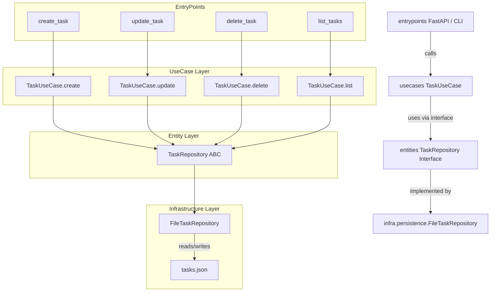

```bash
project_root/
├── core/
│   ├── entities/
│   │   ├── task.py
│   │   ├── assignee.py
│   │   └── repository.py   
│   │
│   ├── interface
│   │   ├── api/
│   │   │   └── task_router.py
│   │   └── cli/
│   │       └── task_handler.py
│   │
│   ├── usecases/
│   │   └── task_usecase.py
│   │
│   └── infrastructure/
│       └── persistence/
│           └── file_repository.py
│   
├── entrypoints/
│   ├── api_main.py
│   ├── cli_main.py
│   └── bot_main.py
├── env
├── README.md
├── requirements.txt
└── tasks.json 

```




# Cli

`create-task`
```bash
python entrypoints/cli_main.py create-task \
  --title "اولیه" --description "تسک تست"
```


```bash
python entrypoints/cli_main.py create-task \
  --title "تحلیل بازار" \
  --description "تحلیل تکنیکال در اکسل" \
  --assignee-id 5 \
  --assignee-name "علی اکبری" \
  --assignee-email "ali@example.com"
```
---

`update-task`
```bash
python entrypoints/cli_main.py update-task \
  --id 1 \
  --title "ویرایش‌شده" \
  --description "توضیح جدید" \
  --assignee-id 10 \
  --assignee-name "محمدی" \
  --assignee-email "mohammadi@example.com"
```

---
`update-task`

```bash
python3 entrypoints/cli_main.py list-tasks
```


# api
`Address`

>> http://127.0.0.1:8000/docs

```json
{
  "title": "تحویل فاز اول",
  "description": "مربوط به طراحی لایه usecase",
  "assignee": {
    "id": 4,
    "name": "رضا پژوهنده",
    "email": "reza@domain.com"
  }
}

```