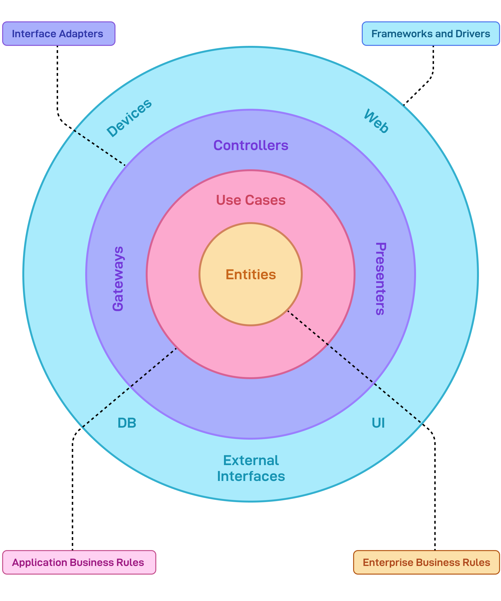

  

---

### 📘 فهرست فصل‌ها: معماری تمیز در توسعه پایتون

#### 🧱 فصل‌های کتاب:

1. [فصل ۱: مبانی معماری تمیز – تحول در توسعه پایتون](./Book/chapter%201:%20Clean%20Architecture%20Essentials:%20Transforming%20Python%20Development.md)
2. [فصل ۲: اصول SOLID – ساخت اپلیکیشن‌های مقاوم با پایتون](./Book/chapter%202:%20SOLID%20Foundations:%20Building%20Robust%20Python%20Applications.md)
3. [فصل ۳: پایتون با تایپ قوی – تقویت معماری تمیز](./Book/chapter%203:%20Type-Enhanced%20Python:%20Strengthening%20Clean%20Architecture.md)
4. [فصل ۴: طراحی مبتنی بر دامنه – ساخت منطق اصلی کسب‌وکار](./Book/chapter%204:%20Domain-Driven%20Design:%20Crafting%20the%20Core%20Business%20Logic.md)
5. [فصل ۵: لایه اپلیکیشن – سازماندهی موارد استفاده](./Book/chapter%205:%20The%20Application%20Layer:%20Orchestrating%20Use%20Cases.md)
6. [فصل ۶: لایه رابط‌ها – کنترلرها و ارائه‌دهنده‌ها](./Book/chapter%206:%20The%20Interface%20Adapters%20Layer:%20Controllers%20and%20Presenters.md)
7. [فصل ۷: لایه چارچوب‌ها و محرک‌ها – ارتباط با دنیای بیرونی](./Book/chapter%207:%20The%20Frameworks%20and%20Drivers%20Layer:%20External%20Interfaces.md)
8. [فصل ۸: الگوهای تست در معماری تمیز](./Book/chapter%208:%20Implementing%20Test%20Patterns%20with%20Clean%20Architecture.md)
9. [فصل ۹: افزودن رابط وب – انعطاف‌پذیری رابط در معماری تمیز](./Book/chapter%209:%20Adding%20Web%20UI:%20Clean%20Architecture’s%20Interface%20Flexibility.md)
10. [فصل ۱۰: پیاده‌سازی قابلیت مشاهده‌پذیری – نظارت و راستی‌آزمایی](./Book/chapter%2010:%20Implementing%20Observability:%20Monitoring%20and%20Verification.md)

---
